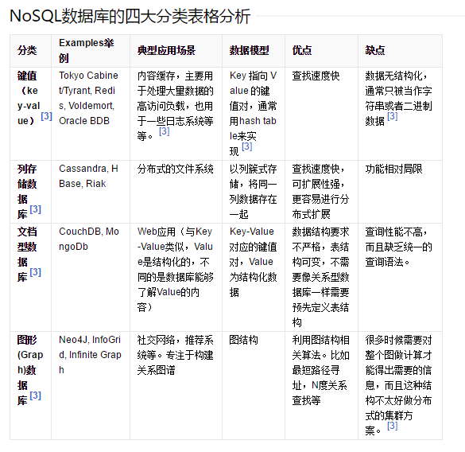
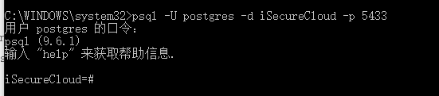

# PostgreSQL

安装  [CentOS 7下安装PostgreSQL 9.6](http://www.jb51.net/article/104829.htm)
##  Json数据类型
postgreSQL支持两种JSON数据，JSON和JSONB，前者存储的是字符串的复制，后者存储的是JSON二进制数据，会提高JSONB数据插入时间，但是读取会快很多，而且JSONB数据支持索引

### JSON函数和操作

    -> 按索引取值  ->'a'  ->2
    ->> 取值按文本返回
    #> 按路径取值 '{"a": {"b":{"c": "foo"}}}'::json#>'{a,b}'
    #>> 按路径取值按文本返回
    以下操作仅jsonb格式支持：
    @> jsonb    Does the left JSON value contain the right JSON path/value entries at the top level?
    <@ jsonb    Are the left JSON path/value entries contained at the top level within the right JSON value?
    ?  test     Does the string exist as a top-level key within the JSON value?
    ?| text[]   Do any of these array strings exist as top-level keys?
    ?& text[]   Do all of these array strings exist as top-level keys?
    || jsonb    Concatenate two jsonb values into a new jsonb value
    -  text or integer delete key/value pair or special index element
    #- text[]   delete the field or element with specified path

    to_json() or to_jsonb()
    e.g. to_json('Fred said "Hi."'::text)
    array_to_json
    row_to_json
    json_build_array
    json_build_object
    json_object()
    jsonb_object()

    json(b)_array_length(json)
    json(b)_each(json)
    e.g. 	select * from json_each('{"a":"foo", "b":"bar"}')	
    key | value
    -----+-------
    a   | "foo"
    b   | "bar"
    json(b)_each_text(json) same as up,return value as text
    json(b)_extract_path()  == #>
    json(b)_extract_path_text() == #>>
    json(b)_object_keys return set of keys in the outermost JSON object
    json(b)_populate_recordset(base,from_json) 
    json(b)_array_elements()
    json(b)_array_elements_text()
    json(b)_typeof()  Possible types are object, array, string, number, boolean, and null
    json(b)_strip_nulls() 忽略所有值value为空
    jsonb_set
    jsonb_pretty

这家伙关于PostgreSQL的博客还不错，MARK：[http://blog.chinaunix.net/uid/20726500/cid-181127-list-12.html](http://blog.chinaunix.net/uid/20726500/cid-181127-list-12.html)

Postgre索引：
1. btree索引
    > 

    sa 
2. gist索引
    > 通用搜索树(Generalized Search Tree),一种平衡树状访问方法 
    > 与gin相比：创建速度快，体积小，但查找速度慢(~3倍)

3. gin索引
    > create index tb1_idx on tb1 using gin(c1,c2) 
    > 创建多个字段上的gin索引 使用倒排索引算法 
    

ACID 数据库事务正确执行的四个基本要素
原子性 Atomicity
一致性 Consistency
隔离性 Isolation 串行化
持久性 Durability

实现ACID的两种主要方式：
+ WAL(Write Ahead Logging) 日志式
+ Shadow Paging 影子分页技术 SQLite `不适合并行事务处理`

- DBMS：Database Management System 数据库管理系统
- DBA:  Database Administrator 数据库管理员

Sql和NoSql

MySql和Postgres比较：

    MySQL是多线程模型，PostgreSQL是多进程模型。
    MySql的SQL层和存储层分离，支持多种存储引擎(InnoDB..)
    PostgreSQL只能通过FDW支持其他存储形式

PostgreSQL命令行模式(windows):

-U 用户
-d 数据库名称
-p 端口(默认5432)

支持的特殊SQL特性：
-------

1. `window functions`  允许针对每一行分组聚集值。(rank()排名)

        SELECT last_name,
        first_name,
        department_id,
        salary,
        rank() over (order by salary DESC) "Overal Rank",
        rank() over (partition by department_id ORDER by salary DESC) "Department Rank"
        FROM employees
        ORDER BY 1,2; 

2. `common table expressions` 很像子查询，不同的是可以在一个查询中被使用多次，并且简化SQL的书写

        WITH plist (id, name) AS (
        SELECT id, 
                firstname||' '||lastname
        FROM person
        WHERE lastname LIKE 'De%'
        )
        SELECT o.amount,
            p.name
        FROM orders o
        JOIN plist p ON p.id = o.person_id;

3. [http://blog.chinaunix.net/uid-20726500-id-5754874.html](http://blog.chinaunix.net/uid-20726500-id-5754874.html)

 
## 索引的类型
1. B-Tree 
CREATE INDEX test1_id_index ON test1 (id)
适用等于或范围查询。对于基于模式匹配操作符的查询，如LIKE、ILIKE、~和 ~*，仅当模式存在一个常量，且该常量位于模式字符串的开头时，如col LIKE 'foo%'或col ~ '^foo'，索引才会生效，否则将会执行全表扫描，如：col LIKE '%bar'。
2. Hash
CREATE INDEX test1_id_hashindex ON test1 USING HASH (id)

3. GiST
4. GIN
5. 复合索引

## 实际应用
 
    iSecureCloud=# CREATE TABLE public."DataOriginal"(
    iSecureCloud(# "Id" SERIAL primary key,
    iSecureCloud(# "SensorId" integer not null,
    iSecureCloud(# "AcqTime" date not null,
    iSecureCloud(# "AcqNum" integer,
    iSecureCloud(# "Value" numeric(18,6)[]);

    iSecureCloud=# Create index ix_dataoriginal_sensorid_acqtime on public."DataOriginal" ("SensorId","AcqTime");

## 时间操作
select now();

select current_timestamp;

select current_date;

select current_time;

select now() + interval '2 years'; (2 year/2 y/2Y ...)

select now() + '2 sec';

-- 计算两个时间差

select age(timestamp,timestamp);

select extract(year from now());

select extract(doy from timestamp '2017-02-10'); -- 一年的第几天

select extract(epoch from now()); -- UTC秒数

psql语法：
-----

    一般性
    \copyright            显示PostgreSQL的使用和发行许可条款
    \errverbose            以最冗长的形式显示最近的错误消息
    \g [文件] or;     执行查询 (并把结果写入文件或 |管道)
    \gexec                 执行策略，然后执行其结果中的每个值
    \gset [PREFIX]     执行查询并把结果存到psql变量中
    \q             退出 psql
    \crosstabview [COLUMNS] 执行查询并且以交叉表显示结果
    \watch [SEC]          每隔SEC秒执行一次查询

    帮助
    \? [commands]          显示反斜线命令的帮助
    \? options             显示 psql 命令行选项的帮助
    \? variables           显示特殊变量的帮助
    \h [名称]          SQL命令语法上的说明，用*显示全部命令的语法说明

    查询缓存区
    \e [FILE] [LINE]        使用外部编辑器编辑查询缓存区(或文件)
    \ef [FUNCNAME [LINE]]   使用外部编辑器编辑函数定义
    \ev [VIEWNAME [LINE]]  用外部编辑器编辑视图定义
    \p                    显示查询缓存区的内容
    \r                    重置(清除)查询缓存区
    \s [文件]        显示历史记录或将历史记录保存在文件中
    \w 文件          将查询缓存区的内容写入文件

    输入/输出
    \copy ...             执行 SQL COPY，将数据流发送到客户端主机
    \echo [字符串]       将字符串写到标准输出
    \i 文件          从文件中执行命令
    \ir FILE               与 \i类似, 但是相对于当前脚本的位置
    \o [文件]        将全部查询结果写入文件或 |管道
    \qecho [字符串]      将字符串写到查询输出串流(参考 \o)

    资讯性
    (选项: S = 显示系统对象, + = 其余的详细信息)
    \d[S+]          列出表,视图和序列
    \d[S+]  名称      描述表，视图，序列，或索引
    \da[S]  [模式]    列出聚合函数
    \dA[+]  [PATTERN]      list access methods
    \db[+]  [模式]     列出表空间
    \dc[S+] [PATTERN]      列表转换
    \dC[+]  [PATTERN]      列出类型强制转换
    \dd[S]  [PATTERN]      显示没有在别处显示的对象描述
    \ddp     [模式]    列出默认权限
    \dD[S+] [PATTERN]      列出共同值域
    \det[+] [PATTERN]      列出引用表
    \des[+] [模式]    列出外部服务器
    \deu[+] [模式]     列出用户映射
    \dew[+] [模式]       列出外部数据封装器
    \df[antw][S+] [模式]    列出[只包括 聚合/常规/触发器/窗口]函数 
    \dF[+]  [模式]   列出文本搜索配置
    \dFd[+] [模式]     列出文本搜索字典
    \dFp[+] [模式]     列出文本搜索解析器
    \dFt[+] [模式]   列出文本搜索模版
    \dg[S+] [PATTERN]      列出角色
    \di[S+] [模式]  列出索引
    \dl                   列出大对象， 功能与\lo_list相同
    \dL[S+] [PATTERN]      列出所有过程语言
    \dm[S+] [PATTERN]      列出所有物化视图
    \dn[S+] [PATTERN]     列出所有模式
    \do[S]  [模式]   列出运算符
    \dO[S+] [PATTERN]      列出所有校对规则
    \dp     [模式]     列出表，视图和序列的访问权限
    \drds [模式1 [模式2]] 列出每个数据库的角色设置
    \ds[S+] [模式]    列出序列
    \dt[S+] [模式]     列出表
    \dT[S+] [模式]  列出数据类型
    \du[S+] [PATTERN]      列出角色
    \dv[S+] [模式]   列出视图
    \dE[S+] [PATTERN]      列出引用表
    \dx[+]  [PATTERN]      列出扩展
    \dy     [PATTERN]      列出所有事件触发器
    \l[+]   [PATTERN]      列出所有数据库
    \sf[+]  FUNCNAME       显示一个函数的定义
    \sv[+]  VIEWNAME       显示一个视图的定义
    \z      [模式]    和\dp的功能相同

    格式化
    \a                  在非对齐模式和对齐模式之间切换
    \C [字符串]        设置表的标题，或如果没有的标题就取消
    \f [字符串]         显示或设定非对齐模式查询输出的字段分隔符
    \H                    切换HTML输出模式 (目前是 关闭)
    \pset [NAME [VALUE]]   设置表输出选项
                            (NAME := {format|border|expanded|fieldsep|fieldsep_zero|footer|null|
                            numericlocale|recordsep|recordsep_zero|tuples_only|title|tableattr|pager|
                            unicode_border_linestyle|unicode_column_linestyle|unicode_header_linestyle})
    \t [开|关]       只显示记录 (目前是 关闭)
    \T [字符串]         设置HTML <表格>标签属性, 或者如果没有的话取消设置
    \x [on|off|auto]       切换扩展输出模式(目前是 关闭)

    连接
    \c[onnect] {[DBNAME|- USER|- HOST|- PORT|-] | conninfo}
                            连接到新数据库（当前是"postgres"）
    \encoding [编码名称] 显示或设定客户端编码
    \password [USERNAME]  安全地为用户更改口令
    \conninfo              显示当前连接的相关信息

    操作系统
    \cd [目录]     更改目前的工作目录
    \setenv NAME [VALUE]   设置或清空环境变量
    \timing [开|关]       切换命令计时开关 (目前是 关闭)
    \! [命令]      在 shell中执行命令或启动一个交互式shell

    变量
    \prompt [文本] 名称 提示用户设定内部变量
    \set [名称 [值数]] 设定内部变量，若无参数则列出全部变量
    \unset 名称    清空(删除)内部变量

    大对象
    \lo_export LOBOID 文件
    \lo_import 文件 [注释]
    \lo_list
    \lo_unlink LOBOID   大对象运算

PostgreSQL 进阶
-------
1. 集群 负载均衡
2. 容灾
3. 读写分析
4. 迁移

* 数据库运维：

        工具
        备份

* 集群：

        内存数据库(缓存机制)
        主备容灾

