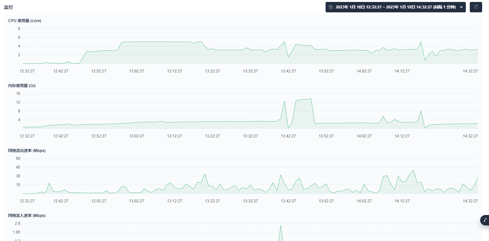
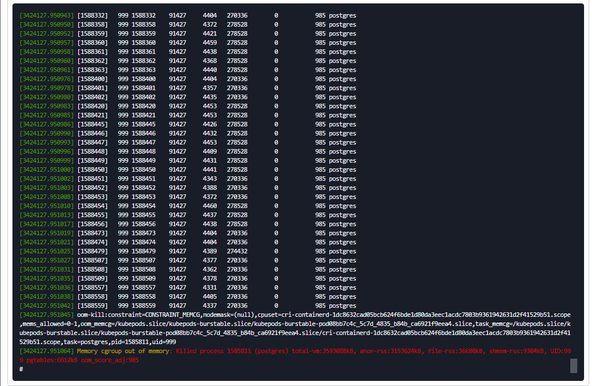

### postgres调优

问题描述：camunda 查询时快时慢。10ms~20s


### 内存占用较高导致 OOM




```shell
2023-01-18 05:41:20.266 UTC [1] LOG:  server process (PID 11028) was terminated by signal 9: Killed
2023-01-18 05:41:20.266 UTC [1] DETAIL:  Failed process was running: SELECT "followupRecord".*, "rpmProjectState"."id" AS "rpmProjectState.id", "rpmProjectState"."project_state" AS "rpmProjectState.projectState", "rpmProjectSuccess"."id" AS "rpmProjectSuccess.id", "rpmProjectSuccess"."project_success" AS "rpmProjectSuccess.projectSuccess" FROM (SELECT * FROM (SELECT "id", "item_id" AS "itemId", "create_time" AS "createTime", "state_id" AS "stateId", "cause", "ground_time" AS "groundTime", "succeed_probability_id" AS "succeedProbabilityId", "amount_money" AS "amountMoney", "bidding", "competitor", "funds_sufficient" AS "fundsSufficient", "plan_agreed" AS "planAgreed", "state_text" AS "stateText", "problem_analysis" AS "problemAnalysis", "next_todo" AS "nextTodo", "remarks", "lost_type" AS "LostType", "create_user_id" AS "createUserId", "owner_unit" AS "ownerUnit", "administrative_unit" AS "administrativeUnit", "channel_unit" AS "channelUnit", "designer_unit" AS "designerUnit", "general_unit" AS "generalUnit", "subcontractor_unit" AS "subcontractorUnit", "project_budget_amount"
2023-01-18 05:41:20.266 UTC [1] LOG:  terminating any other active server processes
2023-01-18 05:41:20.266 UTC [11332] WARNING:  terminating connection because of crash of another server process
2023-01-18 05:41:20.266 UTC [11332] DETAIL:  The postmaster has commanded this server process to roll back the current transaction and exit, because another server process exited abnormally and possibly corrupted shared memory.
2023-01-18 05:41:20.266 UTC [11332] HINT:  In a moment you should be able to reconnect to the database and repeat your command.

FATAL:  the database system is in recovery mode

```

查看OS日志 dmesg




> 插播 Sysctl 命令： Linux系统中用于运行时配置内核参数，这些参数位于 /proc/sys目录下。用户只需要编辑/etc/sysctl.conf文件，即可手工或自动执行由sysctl控制的功能。例如，启动IP路由转发功能：
>
> 1) echo 1> /proc/sys/net/ipv4/ip_forward
>
> 2) sysctl -w net.ipv4.ip_forward=1
>
> 3) 修改/etc/sysctl.conf   net.ipv4.ip_forward=1
>
> 可以通过以下方式避免OOM [https://blog.csdn.net/weixin_39540651/article/details/118967750]
>
> > sysctl -w vm.overcommit_memory=2
> >
> > echo -1000 > /proc/self/oom_score_adj