## 基础篇

RPC 的全称是 Remote Procedure Call。`透明化`

+ 屏蔽远程调用跟**本地调用**的区别，让我们感觉就是调用项目内的方法；
+ **隐藏底层网络**通信的复杂性，让我们更专注于业务逻辑。

组成内容包括：网络编程+编解码（协议）+序列化/反序列化

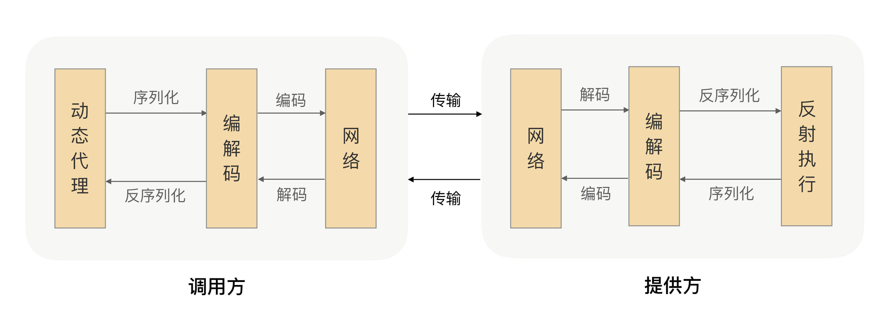

HTTP协议的缺陷：

+ 体积大；太多无效的数据头；无状态协议（每次创建新连接）

RPC协议：

设计的RPC协议应该包含协议头和协议体，其中协议头中应该包含消息ID、整体长度、序列化方式等标识。

为了实现可扩展性：固定部分、协议头内容、协议体内容。协议头长度可变。


###  序列化

1. JDK原生序列化：

```java
public class Student implements Serializable{
    ...
}

// 序列化
ObjectOutputStream oos = new ObjectOutputStream(fos); oos.writeObject(student);

// 反序列化
ObjectInputStream ois = new ObjectInputStream(fis); 
Student deStudent = (Student) ois.readObject();
```

2. json

   文本型序列框架

3. Hessian

   Hessian 是动态类型、二进制、紧凑的，并且可跨语言移植的一种序列化框架。Hessian 协议要比 JDK、JSON 更加紧凑，性能上要比 JDK、JSON 序列化高效很多，而且生成的字节数也更小。

4. Protobuf

   Google内部的混合语言数据标准。使用时需要定义IDL，然后通过不同语言的IDL编译器生成对应的序列化工具类。

   + 体积小
   + 类型完整
   + 速度快
   + 向后兼容性好

> Java语言中可以使用Protostuff (java版本的Protobuf序列化框架)。不依赖IDL可以直接对Java领域对象进行反/序列化操作。

5. 其他： Message pack/ kryo

序列化框架选择中主要考虑的几个因素：

优先级从高到低依次是**安全性、通用性和兼容性**，之后我们会再考虑序列化框架的**性能、效率和空间开销**。

RPC框架使用中**注意**：

+ 对象要尽量简单，没有太多的依赖关系，属性不要太多，尽量高内聚；
+ 入参对象与返回值对象体积不要太大，更不要传太大的集合；
+ 尽量使用简单的、常用的、开发语言原生的对象，尤其是集合类；
+ 对象不要有复杂的继承关系，最好不要有父子类的情况。


### 网络IO模型

+ 同步阻塞IO (BIO)
+ 同步非阻塞IO (NIO)
+ IO多路复用 : 多个网络连接注册到一个复用器上（select），由内核监视所有select负责的socket。`高并发`
+ 异步非阻塞IO (AIO) 


零拷贝？

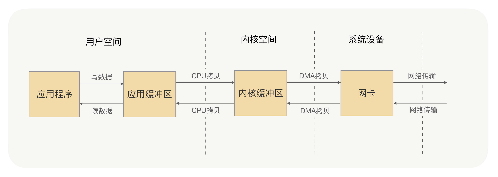

所谓的`零拷贝`，就是取消用户空间与内核空间之间的数据拷贝操作，应用进程每一次的读写操作，都可以通过一种方式，让应用进程向用户空间写入或者读取数据，就如同直接向内核空间写入或者读取数据一样，再通过 DMA 将内核中的数据拷贝到网卡，或将网卡中的数据 copy 到内核。

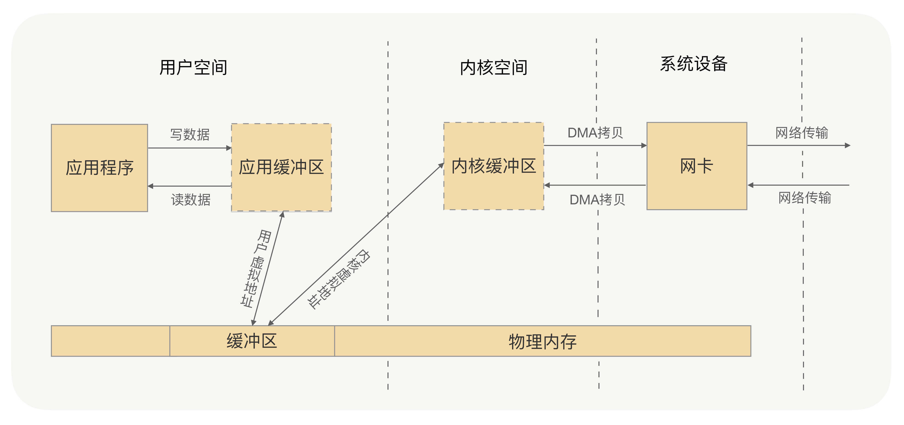

两种解决方案：mmap+write（虚拟内存） 和  sendfile；

> Java中网络框架Netty，实现了零拷贝，主要是用户空间内存的优化，通过CompositeByteBuf、slice、wrap操作来处理TCP传输中的拆包和粘包问题。同时，Netty提供的Direct Buffers直接使用堆外内存进行socket读写，类似虚拟内存的方式实现与内核空间的零拷贝。Netty 还提供FileRegion 中包装 NIO 的 FileChannel.transferTo() 方法实现了零拷贝，这与 Linux 中的 sendfile 方式在原理上也是一样的。
>
> Kafka的零拷贝通过java.nio.channels.FileChannel中的transferTo方法实现底层调用操作系统的sendfile实现。


### 面向接口编程

动态代理：实现本地调用体验的关键。

+ JDK默认的InvocationHandler。（反射实现，缺点是必须实现接口，java不支持多继承）
+ Javassist
+ Byte Buddy


### gRPC源码剖析

gRPC 就是采用 HTTP/2 协议，并且默认采用 PB 序列化方式的一种 RPC。

https://github.com/grpc/grpc-java

```protobuf
syntax = "proto3";

option java_multiple_files = true;
option java_package = "io.grpc.hello";
option java_outer_classname = "HelloProto";
option objc_class_prefix = "HLW";

package hello;

service HelloService{
rpc Say(HelloRequest) returns (HelloReply) {}
}

message HelloRequest {
string name = 1;
}

message HelloReply {
string message = 1;
}
```

发送端：

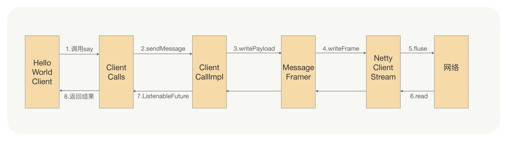

gRPC 的通信协议是基于标准的 HTTP/2 设计的。多路复用、双向流。

接收端：

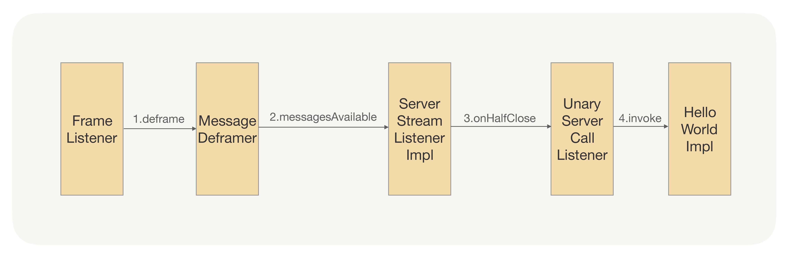

## 进阶篇

### 如何实现一个灵活的RPC框架

一个可用的RPC架构：

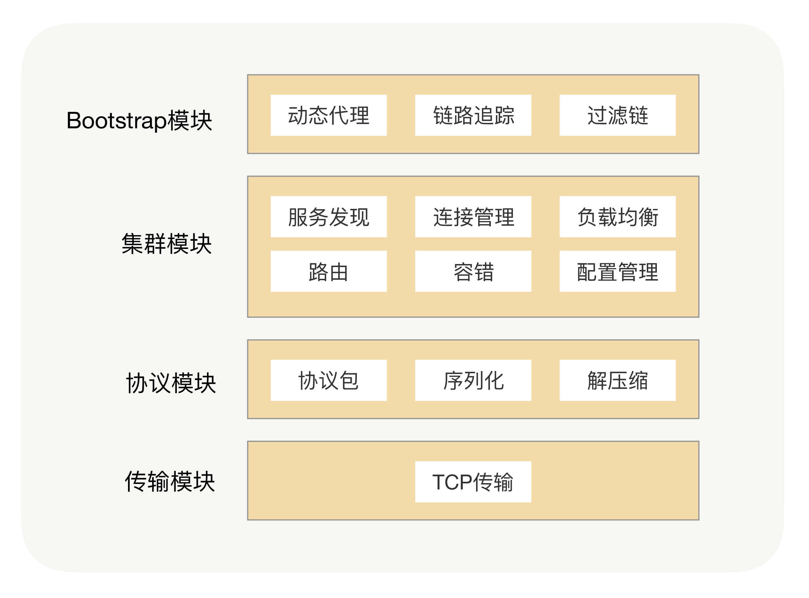

插件化架构：(可扩展性)

在 Java 里面，JDK 有自带的 SPI（Service Provider Interface）服务发现机制（在ClassPath下的Meta-INF/services目录下创建以服务接口命名的文件，包含具体实现类）。`不能按需加载、无法适配其他的扩展（Spring Bean）`。

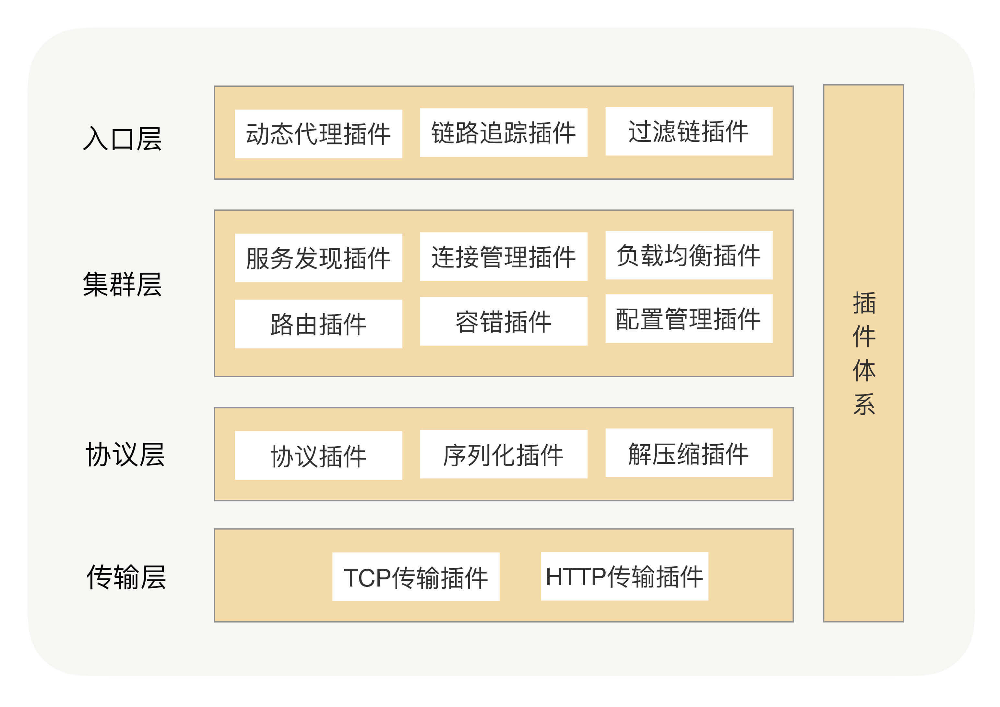

### 服务发现

通过注册中心实现

+ 服务注册
+ 服务发现

基于`zookeeper`的服务发现：利用 ZooKeeper 的 Watcher 机制完成服务订阅与服务下发功能。

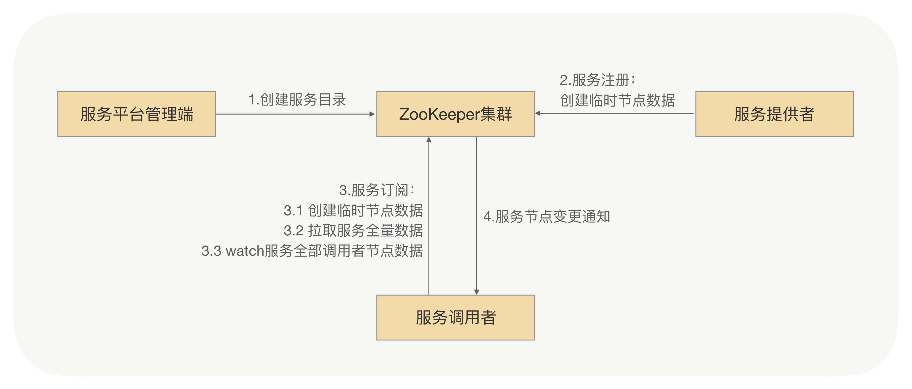

作者在使用zk时出现性能问题（zk数据强一致性），提示可以牺牲掉 CP（强制一致性），而选择AP（最终一致）。最终采用消息总线机制。

“推拉结合，以拉为准。”

### 健康检测

+ 心跳探活
  + 亚健康状态：连续心跳失败
+ 业务请求探活
  + 当**可用率**低于某个比例就认为这个节点存在问题，把它挪到亚健康列表


### 路由策略

灰度过程中常用，其核心思想都是一样的，就是让请求按照我们设定的规则发送到目标节点上，从而实现流量隔离的效果。


### 负载均衡

在调用者自身实现的负载均衡：

RPC 的负载均衡完全由 RPC 框架自身实现，RPC 的服务调用者会与“注册中心”下发的所有服务节点建立长连接，在每次发起 RPC 调用时，服务调用者都会通过配置的负载均衡插件，自主选择一个服务节点，发起 RPC 调用请求。

通过权重配置实现负载均衡策略配置。

设计的自适应负载均衡器：

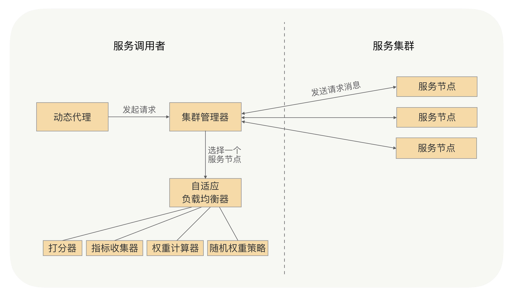

### 重试机制

RPC 框架的重试机制就是调用端发现请求失败时捕获异常（网络异常），之后触发重试。要保证被调用的服务的业务逻辑是幂等的。

+ 考虑了业务逻辑必须是幂等的
+ 超时时间需要重置
+ 去掉有问题的服务节点
+ 重试异常白名单*（允许重试的业务异常）


### 关闭流程

先保证不处理新业务，然后处理完当前任务后关闭。`关闭由外到内；启动从内到外`

在java中通过Runtime.addShutdownHook钩子实现关闭前操作：设置关闭标识、等待当前任务处理完成（引用计数）、关闭服务。

当服务提供方正在关闭，如果这之后还收到了新的业务请求，服务提供方直接返回一个特定的异常给调用方（比如 ShutdownException）。这个异常就是告诉调用方“我已经收到这个请求了，但是我正在关闭，并没有处理这个请求”，然后调用方收到这个异常响应后，RPC 框架把这个节点从健康列表挪出，并把请求自动重试到其他节点，因为这个请求是没有被服务提供方处理过，所以可以安全地重试到其他节点，这样就可以实现对业务无损。


### 优雅启动

**启动预热**：让刚启动的服务提供方应用不承担全部的流量，而是让它被调用的次数随着时间的移动慢慢增加

**延迟暴露**：可以在服务提供方应用启动后，接口注册到注册中心前，预留一个 Hook 过程，让用户可以实现可扩展的 Hook 逻辑。用户可以在 Hook 里面**模拟调用逻辑**，从而使 JVM 指令能够预热起来，并且用户也可以在 Hook 里面事先**预加载一些资源**，只有等所有的资源都加载完成后，最后才把接口注册到注册中心


### 熔断限流

服务提供方的自我保护，对抗高访问量、高并发。

+ 限流：计数器、平滑窗口、漏斗算法、令牌桶算法等。在做限流的时候要考虑应用级别的维度，甚至是 IP 级别的维度。亦可以通过专门的限流服务，均匀限制多节点的请求操作。
+ 熔断机制：熔断机制主要是保护调用端，调用端在发出请求的时候会先经过熔断器

### 业务分组

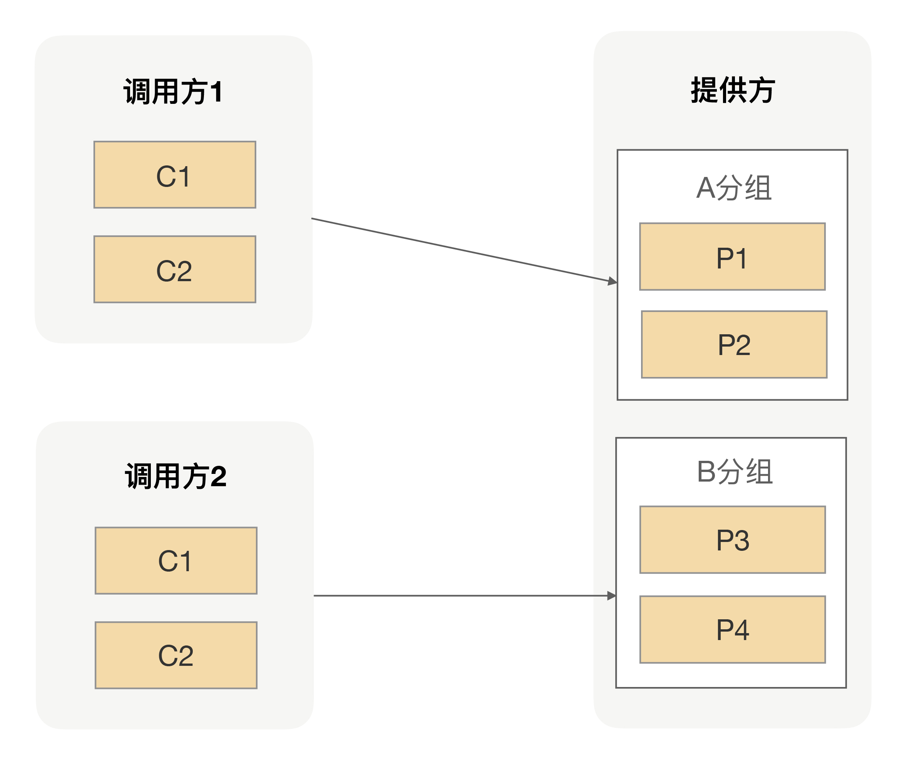

通过分组的方式**隔离调用方**的流量，从而避免因为一个调用方出现流量激增而影响其他调用方的可用率。

举例：车道检修过程中，允许临时借道。RPC配置主次分组，一定程度保证高可用。


## 高阶篇

### 异步RPC：压榨单机吞吐量

客户端：所谓的同步调用，不过是 RPC 框架在调用端的处理逻辑中主动执行了这个Future 的 get 方法，让动态代理等待返回值；而异步调用则是 RPC 框架没有主动执行这个 Future 的 get 方法，用户可以从请求上下文中得到这个 Future，自己决定什么时候执行这个 Future 的 get 方法。

服务端：在java中使用CompletableFuture，实现调用端和服务端完全异步。


### 安全体系

给每个**调用方**设定一个**唯一的身份**，每个调用方在调用之前都先来服务提供方这登记下身份，只有登记过的调用方才能继续放行，没有登记过的调用方一律拒绝。

HMAC 就是一种不可逆加密算法。服务提供方应用里面放一个用于 HMAC 签名的私钥，在授权平台上用这个私钥为申请调用的调用方应用进行签名，这个签名生成的串就变成了调用方唯一的身份。服务提供方在收到调用方的授权请求之后，我们只要需要验证下这个签名跟调用方应用信息是否对应得上就行了，这样集中式授权的瓶颈也就不存在了。

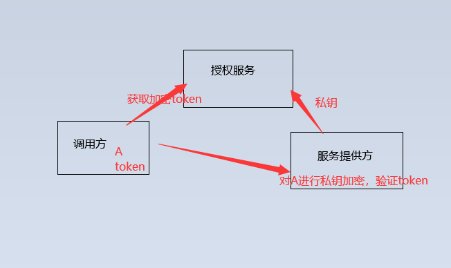

服务注册：验证下请求过来的应用是否跟接口绑定的应用一样，只有相同的才允许注册

