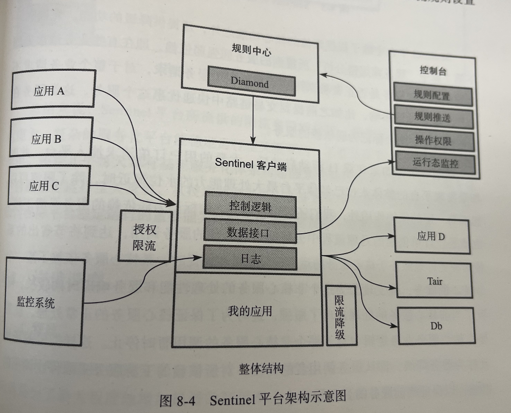
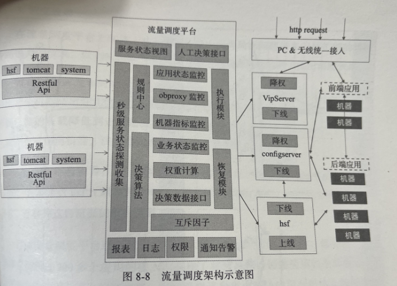
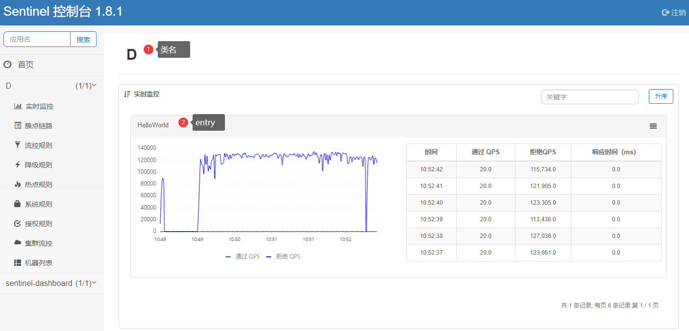
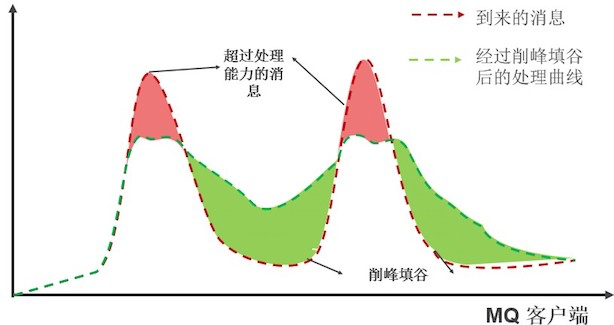

《阿里巴巴中台战略思想与架构实战》


## 打造平台稳定性能力 [Chapter8]

### 限流和降级

在过载的时候掐掉一些流量，让系统有能力集中资源以较快的速度处理平台能力范围内的业务请求。

首先，需要对服务部署的能力有一个准确的评估。(Ali **线上**压测。`QPS`作为限流的关键指标)。

前端接入层（一般Nginx）是最优的限流拦截点（TMD Taobao Missile Defense. `nginx-http-sysguard`）。

服务层Spring的`AOP`机制限流，存在一些问题(跟随应用数增多/没有统一监控界面/限流算法不够平滑（不适合处理毛刺）/无法服务上下游灵活限流)。

推出了 `Sentinel` (哨兵):

- 授权

- 限流

- 降级：非核心服务出现瓶颈时，在核心服务业务逻辑中暂时停用该非核心服务。

- 监控

  


### 流量调度

云服务器上超配，提升机器的资源利用率（虚拟的CPU核数总和超过物理实际的CPU核数）。但可能造成局部或单点负载飙高，出现故障。

单点/局部故障，分布式服务环境调用链路中会被放大到整个链路，会被放大成面。

阿里实现流量调度平台，根据机器的**实时服务能力**来分配机器的实时流量。

- 秒级服务状态探测收集 
- 搜集 系统指标CPU/Load 业务指标:响应时间、QPS、HSF线程池等
- 阿里ConfigServer上调整服务调用的权重 



### 容量压测

实用性、准确性、高效性。

容量压测： 真实的流量引流到压测目标机器上（Ali HSF服务权重修改），跟踪服务器关键指标（CPU、LOAD、QPS、响应时间），到达设定阈值后停止压测。

容量规划：根据单机QPS数据，结合服务器机型处理差异，计算需要的服务器数量。


### 全链路压测平台

阿里为应对双11凌晨的访问洪流，进行的线上全系统、全流程压测

1. 基础数据抽取（和线上数据保持一个量级、数据库中隔离）
2. 链路和模型构造
3. 链路验证
4. 业务改造： 下游写流量的拦截、防止污染BI报表、线上推荐算法等
5. 数据平台：基础数据准备、模型构造、链路构造
6. 流量平台：压测控制中心、压测引擎
7. 影子表
8. 中间件：压测流量的标识
9. 安全机制


# Sentinel

[中文文档](https://github.com/alibaba/Sentinel/wiki/%E4%B8%BB%E9%A1%B5)

[How to use](https://github.com/alibaba/Sentinel/wiki/%E5%A6%82%E4%BD%95%E4%BD%BF%E7%94%A8)

- 流量控制：Sentinel 可以针对不同的调用关系，以不同的运行指标（如 QPS、线程数、系统负载等）为基准，对资源调用进行流量控制，将随机的请求调整成合适的形状（请求匀速、冷启动等）。

- 熔断降级：当调用链路中某个资源出现不稳定的情况，如平均 RT 增高、异常比例升高的时候，Sentinel 会使对此资源的调用请求快速失败，避免影响其它的资源，导致级联失败。

- 系统负载保护：Sentinel 对系统的维度提供保护。当系统负载较高的时候，Sentinel 提供了对应的保护机制，让系统的入口流量和系统的负载达到一个平衡，保证系统在能力范围之内处理最多的请求。

  

  | | Sentinel          | Hystrix                                                | resilience4j            |                                  |
  | ----------------- | ------------------------------------------------------ | ----------------------- | -------------------------------- |
  | 隔离策略          | 信号量隔离（并发控制）                                 | 线程池隔离/信号量隔离   | 信号量隔离                       |
  | 熔断降级策略      | 基于慢调用比例、异常比例、异常数                       | 基于异常比例            | 基于异常比例、响应时间           |
  | 实时统计实现      | 滑动窗口（LeapArray）                                  | 滑动窗口（基于 RxJava） | Ring Bit Buffer                  |
  | 动态规则配置      | 支持近十种动态数据源                                   | 支持多种数据源          | 有限支持                         |
  | 扩展性            | 多个扩展点                                             | 插件的形式              | 接口的形式                       |
  | 基于注解的支持    | 支持                                                   | 支持                    | 支持                             |
  | 单机限流          | 基于 QPS，支持基于调用关系的限流                       | 有限的支持              | Rate Limiter                     |
  | 集群流控          | 支持                                                   | 不支持                  | 不支持                           |
  | 流量整形          | 支持预热模式与匀速排队控制效果                         | 不支持                  | 简单的 Rate Limiter 模式         |
  | 系统自适应保护    | 支持                                                   | 不支持                  | 不支持                           |
  | 热点识别/防护     | 支持                                                   | 不支持                  | 不支持                           |
  | 多语言支持        | Java/Go/C++                                            | Java                    | Java                             |
  | Service Mesh 支持 | 支持 Envoy/Istio                                       | 不支持                  | 不支持                           |
  | 控制台            | 提供开箱即用的控制台，可配置规则、实时监控、机器发现等 | 简单的监控查看          | 不提供控制台，可对接其它监控系统 |

### 启动Dashboard

```shell
java -Dserver.port=8080 -Dcsp.sentinel.dashboard.server=localhost:8080 -Dproject.name=sentinel-dashboard -jar sentinel-dashboard.jar
```

登录名和密码都是sentinel

Dashboard的作用：

- [**查看机器列表以及健康情况**](https://github.com/alibaba/Sentinel/wiki/控制台#4-查看机器列表以及健康情况)：收集 Sentinel 客户端发送的心跳包，用于判断机器是否在线。
- [**监控 (单机和集群聚合)**](https://github.com/alibaba/Sentinel/wiki/控制台#5-监控)：通过 Sentinel 客户端暴露的监控 API，定期拉取并且聚合应用监控信息，最终可以实现秒级的实时监控。
- [**规则管理和推送**](https://github.com/alibaba/Sentinel/wiki/控制台#6-规则管理及推送)：统一管理推送规则。
- [**鉴权**](https://github.com/alibaba/Sentinel/wiki/控制台#鉴权)：生产环境中鉴权非常重要。这里每个开发者需要根据自己的实际情况进行定制。

### 客户端接入

```xml
<!-- replace here with the latest version -->
<dependency>
    <groupId>com.alibaba.csp</groupId>
    <artifactId>sentinel-core</artifactId>
    <version>1.8.1</version>
</dependency>
<dependency>
    <groupId>com.alibaba.csp</groupId>
    <artifactId>sentinel-transport-simple-http</artifactId>
    <version>1.8.1</version>
</dependency>
```

客户端Demo.java. 定义了一个QPS20的Helloword打印程序。

```java
public class D {
    public static void main(String[] args) {
        initFlowRules();
        while (true) {
            Entry entry = null;
            try {
                entry = SphU.entry("HelloWorld");
            /*您的业务逻辑 - 开始*/
                System.out.println("hello world");
            /*您的业务逻辑 - 结束*/
            } catch (BlockException e1) {
            /*流控逻辑处理 - 开始*/
                System.out.println("block!");
            /*流控逻辑处理 - 结束*/
            } finally {
                if (entry != null) {
                    entry.exit();
                }
            }
        }
    }

    private static void initFlowRules() {
        List<FlowRule> rules = new ArrayList<>();
        FlowRule rule = new FlowRule();
        rule.setResource("HelloWorld");
        rule.setGrade(RuleConstant.FLOW_GRADE_QPS);
        // Set limit QPS to 20.
        rule.setCount(20);
        rules.add(rule);
        FlowRuleManager.loadRules(rules);
    }
}
```

启动时加VM参数`-Dcsp.sentinel.dashboard.server=localhost:8080` 或者写在 `sentinel.properties` [配置文件](https://github.com/alibaba/Sentinel/wiki/%E5%90%AF%E5%8A%A8%E9%85%8D%E7%BD%AE%E9%A1%B9)中

### 监控



- 机器列表中显示各机器健康状态
- 簇点链路：各个客户端链路的调用情况
- 实时监控汇总资源（上图）

[监控API](https://github.com/alibaba/Sentinel/wiki/%E5%AE%9E%E6%97%B6%E7%9B%91%E6%8E%A7)：

- http://localhost:8720/clusterNode

  - 默认客户端8719，因为本机启动了Dashboard自占用了。客户端未设置自动往下嗅探空闲端口(8720)。

- http://localhost:8720/cnode?id=HelloWorld 

  ```shell
  idx id         thread    pass      blocked   success    total    aRt   1m-pass   1m-block   1m-all   exception  
  2   HelloWorld 0         20.0      86502.0   20.0       86522.0  0.0   1200      7775391    7776591  0.0    
  ```

- http://localhost:8720/origin?id=* 簇点调用者统计

- http://localhost:8720/tree 链路情况

- http://localhost:8720/metric?identity=HelloWorld&startTime=1620783110000&endTime=1620790310000&maxLines=10

  返回秒级调用统计metrics；（和`${home}/logs/csp/${appName}-metrics.log.${date}.xx`日志内容格式一致）

  ```shell
  1620784480000|HelloWorld|20|183622|20|0|1|0|0|0
  时间戳|resourceName|每秒通过|每秒拦截|每秒完成|每秒异常|平均响应|该秒占用未来请求数|预留|资源分类
  ```

### [主流框架适配](https://github.com/alibaba/Sentinel/wiki/%E4%B8%BB%E6%B5%81%E6%A1%86%E6%9E%B6%E7%9A%84%E9%80%82%E9%85%8D)

其他几个框架先忽略，主要学习RocketMQ中的限流思想。适配的框架主要有：

Spring Boot/Spring Cloud / Web Servlet / Apache Dubbo /gPRC / Apache HttpClient / OkHttp / Reactor / Spring Cloud Gateway

#### Apache RocketMQ

削峰填谷 --  [匀速器](https://github.com/alibaba/Sentinel/wiki/限流---匀速器)模式，匀速排队模式对应的是漏桶算法




```java
private void initFlowControlRule() {
    FlowRule rule = new FlowRule();
    rule.setResource(KEY); // 对应的 key 为 `groupName:topicName`
    rule.setCount(5);
    rule.setGrade(RuleConstant.FLOW_GRADE_QPS);
    rule.setLimitApp("default");

    // 匀速器模式下，设置了 QPS 为 5，则请求每 200 ms 允许通过 1 个
    rule.setControlBehavior(RuleConstant.CONTROL_BEHAVIOR_RATE_LIMITER);
    // 如果更多的请求到达，这些请求会被置于虚拟的等待队列中。等待队列有一个 max timeout，如果请求预计的等待时间超过这个时间会直接被 block
    // 在这里，timeout 为 5s
    rule.setMaxQueueingTimeMs(5 * 1000);
    FlowRuleManager.loadRules(Collections.singletonList(rule));
}
```

在处理消息的地方埋点处理：

```java
private static void doSomething(MessageExt message) {
    pool.submit(() -> {
        Entry entry = null;
        try {
            ContextUtil.enter(KEY);
            entry = SphU.entry(KEY, EntryType.OUT);

            // 在此处理消息.
            System.out.printf("[%d][%s][Success: %d] Receive New Messages: %s %n", System.currentTimeMillis(),
                Thread.currentThread().getName(), successCount.addAndGet(1), , new String(message.getBody()));
        } catch (BlockException ex) {
            // Blocked.
			// NOTE: 在处理请求被拒绝的时候，需要根据需求决定是否需要重新消费消息
            System.out.println("Blocked: " + failCount.addAndGet(1));
        } finally {
            if (entry != null) {
                entry.exit();
            }
            ContextUtil.exit();
        }
    });
}
...
@SuppressWarnings("PMD.ThreadPoolCreationRule")
private static final ExecutorService pool = Executors.newFixedThreadPool(32);
```

#### *Kafka

标签：`kafka`  `scala` `anxinyun` `et` 

参考RocketMQ实现，实现对Kafka的限流匀速。

```scala
import java.util.concurrent.atomic.AtomicInteger

import com.alibaba.csp.sentinel.slots.block.BlockException
import com.alibaba.csp.sentinel.{Entry, EntryType, SphU}
import comm.models.IotaData
import comm.utils.{Expiring, KafkaDataWorker, Loader}

/**
  * Kafka sentinel 限流测试
  */
object KafkaSenti extends Expiring {
    val KEY = "IotaDevice"
    val pass = new AtomicInteger()
    val block = new AtomicInteger()
    val done = new AtomicInteger()

    def main(args: Array[String]): Unit = {
        configRefreshInterval = 10 * 1000

        val props = Loader.from("/config.properties", args: _*)
        initFlowControlRule()
        System.setProperty("scala.concurrent.context.minThreads", "8")
        System.setProperty("scala.concurrent.context.maxThreads", "100")
        //        props.setProperty("kafka.handle.async","false")
        KafkaDataWorker[IotaData](props, "anxinyun_data4", handleData).start()
    }

    def handleData(data: IotaData): Unit = {
        var entry: Entry = null
        validate()
        try {
            entry = SphU.entry(KEY)
            //            entry = SphU.entry(data.deviceId, EntryType.IN)
            //            println(s"handle data $data")
        } catch {
            case tr: Exception =>
                if (BlockException.isBlockException(tr)) {
                    // block handle
                    block.incrementAndGet()
                    //                    println(s"${data.deviceId} data blocked")
                } else {
                    // 数据处理处理
                }
        } finally {
            if (entry != null) {
                entry.exit()
                pass.incrementAndGet()
            }
            done.incrementAndGet()
        }
    }

    override def refresh(): Unit = {
        println("total pass:" + pass.get() + ", total block:" + block.get())
    }

    import java.util.Collections

    import com.alibaba.csp.sentinel.slots.block.RuleConstant
    import com.alibaba.csp.sentinel.slots.block.flow.{FlowRule, FlowRuleManager}

    private def initFlowControlRule(): Unit = {
        val rule = new FlowRule
        rule.setResource(KEY)
        rule.setCount(1) // QPS 1
        rule.setGrade(RuleConstant.FLOW_GRADE_QPS)
        rule.setLimitApp("default")
        // 匀速器模式下，设置了 QPS 为 1，则请求每 200 ms 允许通过 1 个
        //        rule.setControlBehavior(RuleConstant.CONTROL_BEHAVIOR_RATE_LIMITER)
        // 如果更多的请求到达，这些请求会被置于虚拟的等待队列中。等待队列有一个 max timeout，如果请求预计的等待时间超过这个时间会直接被 block
        // 在这里，timeout 为 1 day 允许至多积压一天(86400条)的数据进入
        //        rule.setMaxQueueingTimeMs(10 * 1000)
        //        rule.setMaxQueueingTimeMs(86400 * 1000)
        FlowRuleManager.loadRules(Collections.singletonList(rule))
    }
}

```


### [在生产环境使用](https://github.com/alibaba/Sentinel/wiki/%E5%9C%A8%E7%94%9F%E4%BA%A7%E7%8E%AF%E5%A2%83%E4%B8%AD%E4%BD%BF%E7%94%A8-Sentinel)

**规则管理及推送**

一般来说，规则的推送有下面三种模式:

| 推送模式                                                     | 说明                                                         | 优点                         | 缺点                                                         |
| ------------------------------------------------------------ | ------------------------------------------------------------ | ---------------------------- | ------------------------------------------------------------ |
| [原始模式](https://github.com/alibaba/Sentinel/wiki/在生产环境中使用-Sentinel#原始模式) | API 将规则推送至客户端并直接更新到内存中，扩展写数据源（[`WritableDataSource`](https://github.com/alibaba/Sentinel/wiki/动态规则扩展)） | 简单，无任何依赖             | 不保证一致性；规则保存在内存中，重启即消失。严重不建议用于生产环境 |
| [Pull 模式](https://github.com/alibaba/Sentinel/wiki/在生产环境中使用-Sentinel#Pull模式) | 扩展写数据源（[`WritableDataSource`](https://github.com/alibaba/Sentinel/wiki/动态规则扩展)）， 客户端主动向某个规则管理中心定期轮询拉取规则，这个规则中心可以是 RDBMS、文件 等 | 简单，无任何依赖；规则持久化 | 不保证一致性；实时性不保证，拉取过于频繁也可能会有性能问题。 |
| **[Push 模式](https://github.com/alibaba/Sentinel/wiki/在生产环境中使用-Sentinel#Push模式)** | 扩展读数据源（[`ReadableDataSource`](https://github.com/alibaba/Sentinel/wiki/动态规则扩展)），规则中心统一推送，客户端通过注册监听器的方式时刻监听变化，比如使用 Nacos、Zookeeper 等配置中心。这种方式有更好的实时性和一致性保证。**生产环境下一般采用 push 模式的数据源。** | 规则持久化；一致性；快速     | 引入第三方依赖                                               |

商用环境推荐使用 **Push模式** ：

 **配置中心控制台/Sentinel 控制台 → 配置中心 → Sentinel 数据源 → Sentine**


### 工作原理

所有资源对应一个资源名称（`resourceName`），资源调用创建`Entry`对象（主流框架适配/注解低侵入式/`SphU` API显示创建）。同时会创建一系列功能插槽(slot chain)


- `NodeSelectorSlot` 负责收集资源的路径，并将这些资源的调用路径，以树状结构存储起来，用于**根据调用路径**来限流降级；
- `ClusterBuilderSlot` 则用于存储资源的统计信息以及调用者信息，例如该资源的 RT（平均响应时间）, QPS, thread count 等等，这些信息将用作为多维度限流，降级的依据；
- `StatisticSlot` 则用于记录、统计不同纬度的 runtime 指标监控信息；
- `FlowSlot` 则用于根据预设的限流规则以及前面 slot 统计的状态，来进行流量控制；
  - FlowRule：  grade（QPS模式1和并发线程模式0）controlBehavior（控制效果：直接拒绝、WarmUp、匀速排队）LimitApp（来源）
- `AuthoritySlot` 则根据配置的黑白名单和调用来源信息，来做黑白名单控制；
- `DegradeSlot` 则通过统计信息以及预设的规则，来做熔断降级；
  - DegradeRule：grade 熔断策略，支持慢调用比例/异常比例/异常数策略；timeWindow-熔断时间s；
- `SystemSlot` 则通过系统的状态，例如 load1 等，来控制总的入口流量；**系统规则只对入口流量起作用（调用类型为 `EntryType.IN`）**
  - SystemRule: highestSystemLoad(load1触发值，用于触发自适应控制阶段) avgRt(所有**入口流量**的RT)  maxTread 入口流量的最大并发数  qps 所有入口资源的QPS； highestCpuUsage(CPU使用率0~1)


### 热点参数限流

```xml
<dependency>
    <groupId>com.alibaba.csp</groupId>
    <artifactId>sentinel-parameter-flow-control</artifactId>
    <version>x.y.z</version>
</dependency>
```


## Flink应用

标签：`flink` `scala` `anxinyun` `et` 

ToDo

## 源码学习

https://www.cnblogs.com/luozhiyun/tag/Sentinel/

ToDo


# 其他

## azure

[Iot Hub配额和节流](https://docs.microsoft.com/en-us/azure/iot-hub/iot-hub-devguide-quotas-throttling )

 IoT Hub 处理突发流量的方法： 突发流量请求的前几个会被立即处理，后续请求会被放进队列，并以限制速率处理。流量整形。 如果违规继续，最终队列将填满，IoT Hub返回429 ThrottlingException拒绝请求。


# 结论

Sentinel比较适用于无状态请求，例如网站用户的业务请求（调用RESTful API）。在我们物联网数据处理场景中，不是很适用。

流量整形的匀速模式，没有办法对突发数据进行缓存，不能满足我们‘先缓存，漫处理’，保证数据（突发性数据前部分）不丢失的场景。

放弃该方案。 Sad！

