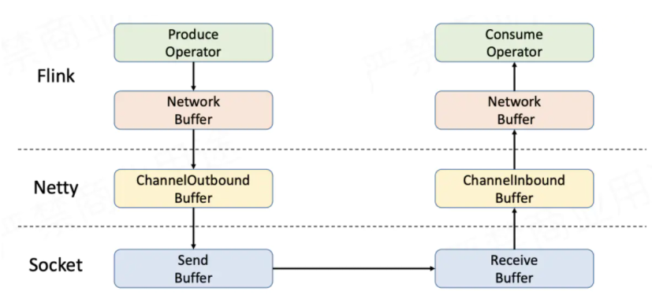
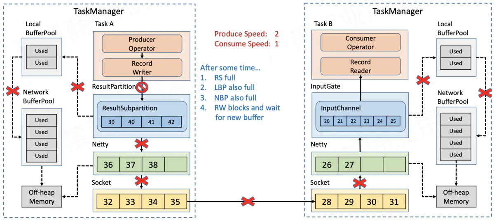
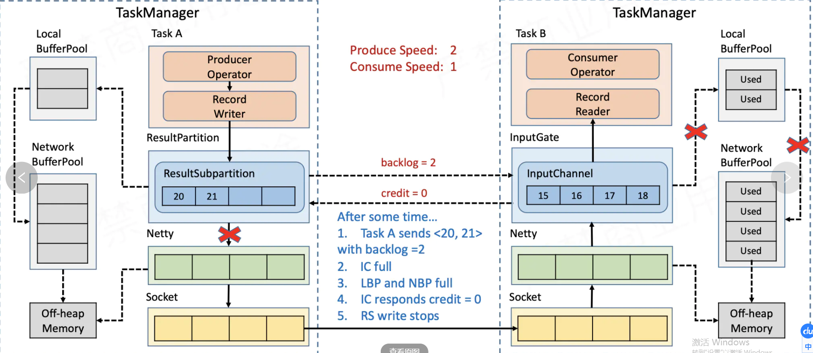
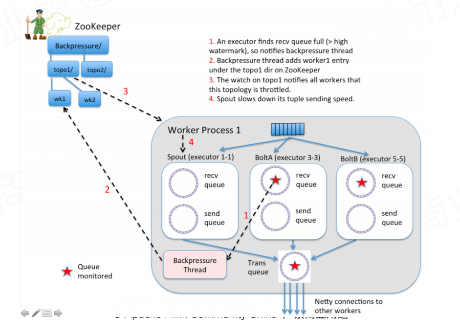
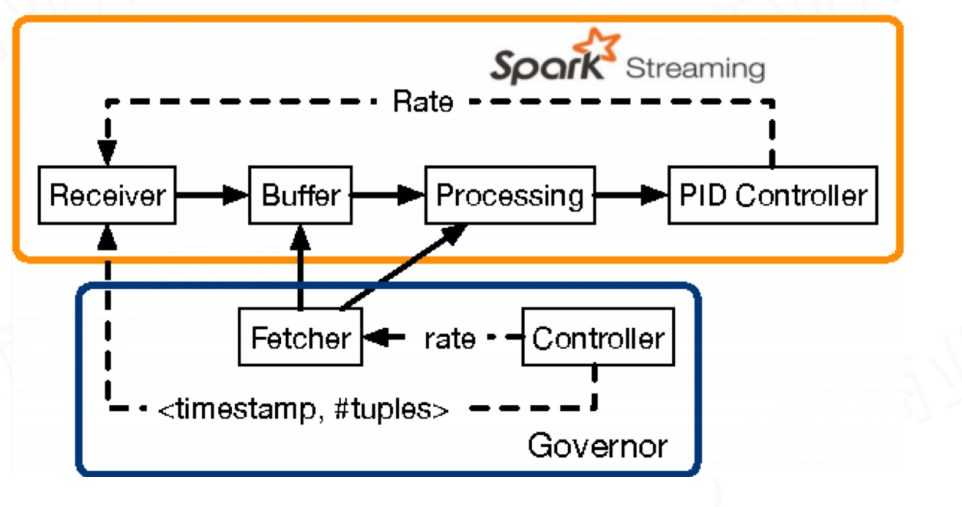
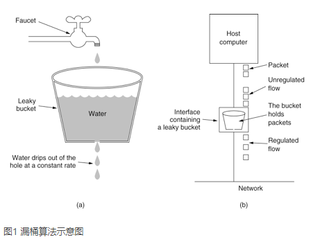
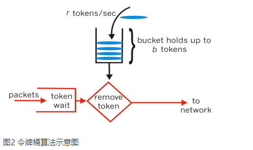

限流控制之二： Flink背压机制

## 流控(Flow Control)

1. 背压(Back pressure)

   接收方根据自己的接收窗口的情况来控制接收速率，并通过反向的ACK包来控制发送方的发送速率。

> Hot Observable 和 Cold Observable: 
>
> 把一个Hot Observable 想象成一个广播电台，所有在此刻收听的听众都会听到同一首歌
>
> 而Cold Observable 一张音乐CD，人们可以独立购买并听取它

2. 节流(Throttling)

   处理不过来的就丢弃。包含策略一般：sample(or throttleLast)、throttleFirst、debounce(or throttleWithTimeout)。

3. 打包（buff/window）

   把上游多个小包裹打包成大包裹。

4. 阻塞整个调用链(Call stack blocking)

   整个调用链单线程的时候，可以通过阻塞简单处理。

## Flink背压

Flink网络传输数据流向：



### 1.5版本之前： 基于TCP的流控和反压

通过传输层依靠TCP协议自身具备的滑动窗口机制，实现流控和背压。

当上游producer速率比下游consumer高，下游Task中InputChannel缓存被耗尽。Netty的auto read被关闭，不再从socket缓存数据。接收Socket缓存耗尽后Receiver报告Window=0，Sender的socket就会停止发送；

Sender缓存积压，导致Netty无法发送数据；导致上游Task中ChannelOutboundBuffer数据量超过Netty的High watermark，Channel不可写，ResultSubPartition就不再向Netty写数据。ResultSubPartition满之后，RecordWriter不再向其写入数据。

到此，实现了反压向上游TaskManager的传递、




### 1.5版本之后：基于Credit的流控和反压

上述方法，影响其他正常的Task，以及Checkpoint Barrier的流动，容易造成作业雪崩。 触发反压链路长，延时比较大。

1.5版本之后，flink引入credit机制：

应用层：ResultPartition<---> InputGate。  block size >>      << credit




### Storm反压




### Spark-Stream反压




## 漏桶和令牌通算法介绍

https://www.cnblogs.com/xuwc/p/9123078.html





令牌桶算法 Guava `RateLimiter`。

作者： 保护自己系统，使用令牌；保护他人系统（调用的第三方服务），使用漏桶；

令牌桶限制的是平均流入速率，允许一定程度突发流量；漏桶限制的是常量流出速率，起到平滑；

**令牌桶**

设置的用户传输数据的速率被称为承诺信息速率(**`CIR`** Credit Information Rate).

一次性加进的令牌数量被称为Burst size（Bc）;

加令牌的时间，Time interval（Tc）, Bc/ CIR= Tc

**限流特技**

一般开发高并发系统常见的限流有：限制总并发数（比如数据库连接池、线程池）、限制瞬时并发数（如nginx的limit_conn模块，用来限制瞬时并发连接数）、限制时间窗口内的平均速率（如Guava的RateLimiter、nginx的limit_req模块，限制每秒的平均速率）；其他还有如限制远程接口调用速率、限制MQ的消费速率。另外还可以根据网络连接数、网络流量、CPU或内存负载等来限流。

## RateLimiter in Guava

```scala
import com.google.common.util.concurrent.RateLimiter
@Test
class CodecTest {

    @Test
    @Ignore
    def testRateLimiter(): Unit = {
        val r = RateLimiter.create(0.5) // QPS 0.5:  1/2sec
        System.out.println(r.acquire(1))
        Thread.sleep(10000)
        while (true) {
            System.out.println(r.acquire(1))
            System.out.println(r.acquire(1))
            System.out.println(r.acquire(1))
            System.out.println(r.acquire(1))
            System.out.println(r.acquire(1))
            System.out.println(r.acquire(1))
            System.out.println(r.acquire(1))
        }
    }
}
```


## [bucket4j](https://github.com/vladimir-bukhtoyarov/bucket4j)

example

```java
public class C {

    public static void main(String[] args) throws InterruptedException {
        Bucket bucket = Bucket4j.builder()
            .addLimit(Bandwidth.simple(1, Duration.ofSeconds(1)).withInitialTokens(100)) // with init tokens
            .addLimit(Bandwidth.simple(50, Duration.ofMinutes(1))) // multi limit
            .build();

        for (int i = 0; i < 100; i++) {
            if (bucket.tryConsume(1)) {
                try {
                    System.out.println("get");
                } catch (Exception ex) {
                    bucket.addTokens(1); // return token back
                }
            } else {
                System.out.println("block");
            }
            Thread.sleep(100);
            // using bucket as scheduler
//            bucket.asScheduler().consume(1);
//            System.out.println("get");
        }
    }
}
```

