## 实战准备：如何搭建硬件开发环境

参考课程 https://time.geekbang.org/column/article/321652

NodeMCU https://nodemcu.readthedocs.io/en/release

MicroPython ESP8266: https://docs.micropython.org/en/latest/esp8266/quickref.html#

https://docs.micropython.org/en/latest/esp8266/tutorial/index.html


连接NodeMCU：

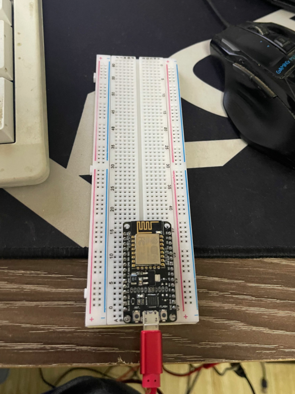


下载驱动：
https://www.silabs.com/developers/usb-to-uart-bridge-vcp-drivers 


下载兼容ESP8266的MicroPython固件： https://micropython.org/download/esp8266/


安装python 2.7.15

```python
pip install esptool
```


```
.\esptool.py.exe --port COM3 erase_flash

.\esptool.py.exe --port COM3 --baud 460800 write_flash --flash_size=detect 0 esp8266-20220117-v1.18.bin

python3 pyboard.py --device COM3 -f cp main.py :

```

可以看到如下名称的wifi热点：

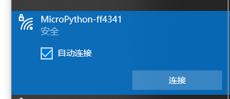

使用putty连接:

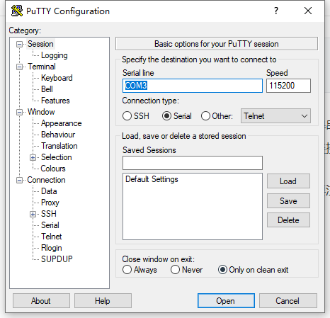

> 进入REPL后无法输入
>
> https://github.com/micropython/micropython/issues/587
>
> 使用SecureCRT连上之后也无法进行交互输入。通过 `flowcontrol = none`解决
>
> > I re uploaded the micropython firmware and, just for fun, i tried to open with the arduino serial monitor. And it worked.
> > Back to `minicom` and check settings... `Hardware Flow Control `was on... Once I turned it `off` it works!
> >
> > Sorry for the wasted time.
>
> still important in 2020 (putty flowcontrol = none)
>
>  
>
> 如果程序运行中，无法进入REPL，连续按 CTRL+C 配合板子rst键使用，可进入。


编写main.py，复制到开发板上：

> 1. 使用`pyboard.py` 工具： https://docs.micropython.org/en/latest/reference/pyboard.py.html
> 2. 必须用python3执行
> 3. pip装包时报`SSL`错误需关掉梯子
> 4.  module 'serial' has no attribute '__version__'

```sh
set PYBOARD_DEVICE=COM3
python3 pyboard.py -f cp main.py :

# or
python3 pyboard.py --device COM3 -f cp main.py :

# 说明
 -f, --filesystem      perform a filesystem action: cp local :device | cp
                        :device local | cat path | ls [path] | rm path | mkdir
                        path | rmdir path
```

首先`pip install serial`

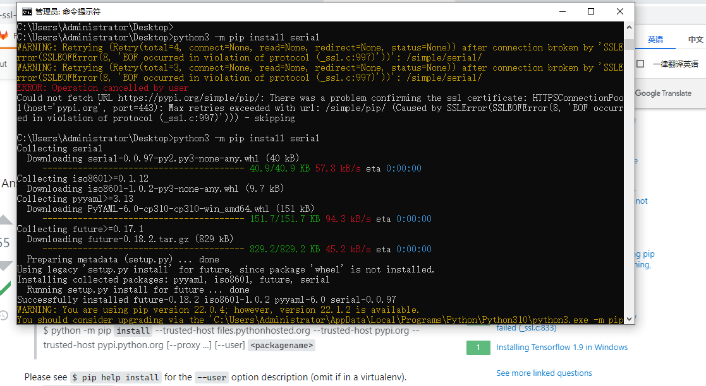


main.py

```python
import machine
import time

# 指明 GPIO2 管脚
pin = machine.Pin(2, machine.Pin.OUT)

# 循环执行
while True:
    time.sleep(2)   # 等待 2 秒
    pin.on()        # 控制 LED 状态
    time.sleep(2)   # 等待 2 秒
    pin.off()       # 切换 LED 状
```


[Micro.python ESP8266 API](https://docs.micropython.org/en/latest/esp8266/quickref.html)


## 打造物联网智能电灯

登录[腾讯云](https://console.cloud.tencent.com/iotexplorer/project/prj-jxclb2zd/product/createproduct) > 新建项目 > 新建产品 > 使用“照明》灯”的默认物模型

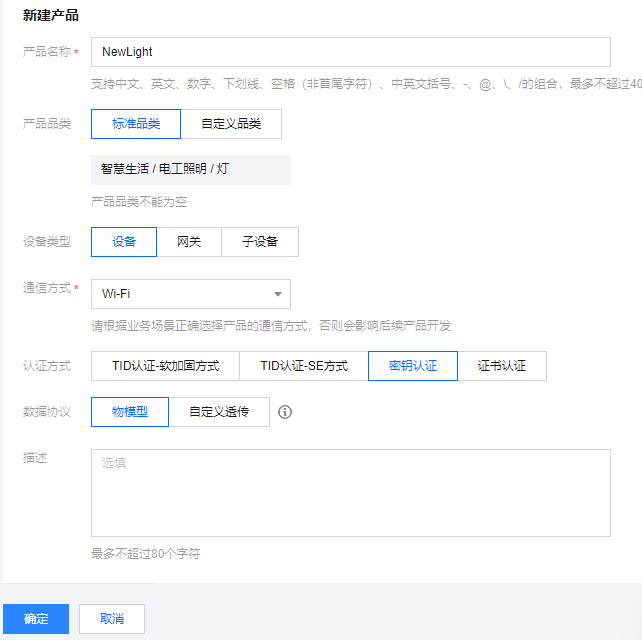

新建设备，进入设备详情页：

**设备名称（DeviceName）、设备秘钥（SecretKey）和产品 ID（ProductID）也经常被称为设备三元组。**

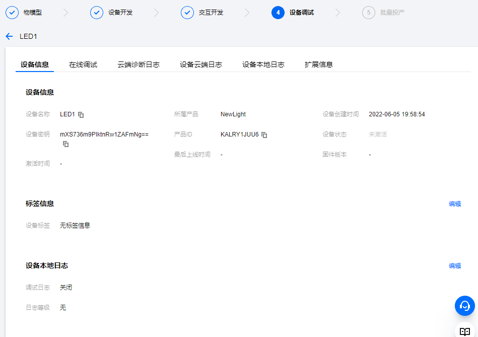


### 设备开发

使用 PWM （Pulse Width Modulation，脉冲宽度调制）来实现控制 LED 的颜色和亮度的。

PWM 信号是一个方波信号，通过调节占空比来调节输出的平均电压，进而达到控制LED颜色、亮度的效果。

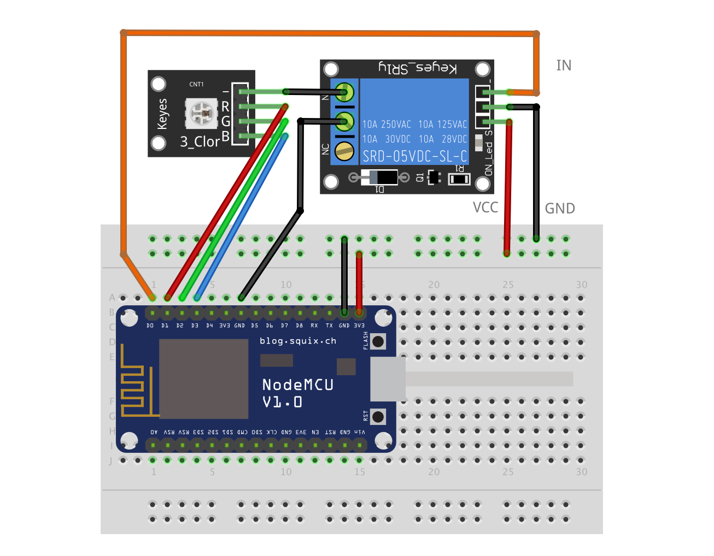

### NodeMCU 连接WiFi

> Wi-Fi模块https://nodemcu.readthedocs.io/en/release/modules/wifi/#wifigetchannel
>
> 连接到 Wi-Fi 网络称为站点(Stations，简称为STA)。提供Wi-Fi 连接信号称为接入点 (Access Point ，简称为AP).
>
> 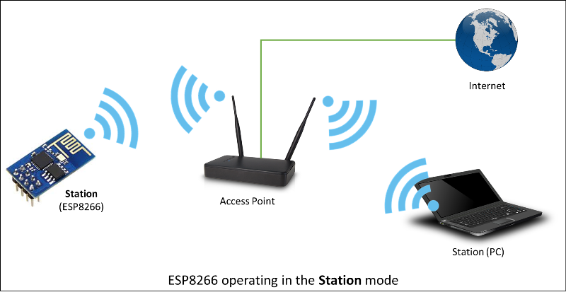
>
> 官网：
> 
> The [`network`](https://docs.micropython.org/en/latest/library/network.html#module-network) module:
> 
> ```
> import network
> 
> wlan = network.WLAN(network.STA_IF) # create station interface
> wlan.active(True)       # activate the interface
>wlan.scan()             # scan for access points
> wlan.isconnected()      # check if the station is connected to an AP
>wlan.connect('FuckYou', 'nimei:123456_') # connect to an AP
> wlan.config('mac')      # get the interface's MAC address
>wlan.ifconfig()         # get the interface's IP/netmask/gw/DNS addresses
> 
> ap = network.WLAN(network.AP_IF) # create access-point interface
> ap.active(True)         # activate the interface
> ap.config(essid='ESP-AP') # set the ESSID of the access point
> ```
> 
> A useful function for connecting to your local WiFi network is:
> 
> ```
> def do_connect():
>  import network
>  wlan = network.WLAN(network.STA_IF)
>  wlan.active(True)
>  if not wlan.isconnected():
>      print('connecting to network...')
>     wlan.connect('essid', 'password')
>      while not wlan.isconnected():
>         pass
>  print('network config:', wlan.ifconfig())
> ```
>    
>    Once the network is established the [`socket`](https://docs.micropython.org/en/latest/library/socket.html#module-socket) module can be used to create and use TCP/UDP sockets as usual.


### NodeMCU 连接MQTT 

> ```python
> import upip
> upip.install('micropython-umqtt.simple')
> ```

通过[网页工具](https://iot-exp-individual-1258344699.cos.ap-guangzhou.myqcloud.com/password%E7%94%9F%E6%88%90%E5%B7%A5%E5%85%B7.zip)计算腾讯云三元组

源代码见 [代码解析](src\iot-led\main.py)

调试工具和最终文件树界面：

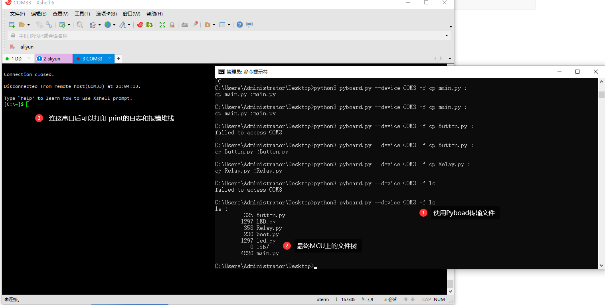

实体连线界面：

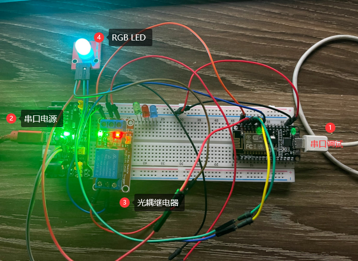

可通过腾讯连连小程序调节：

  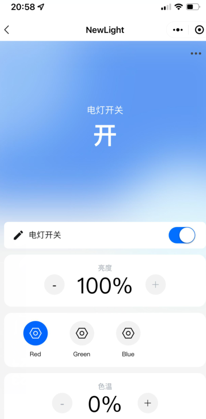


## 附件

WoT.City 的 Web of Things Framework 就是依靠不同 IoT 类型

| IoT Node (Device Type)      | Solution Platform                            | IoT Diagram (Use Scenario)                           |
| :-------------------------- | :------------------------------------------- | :--------------------------------------------------- |
| Single Board Computer (SBC) | Intel Edison、Qualcomm Dragonboard 410c etc. | IoT Router etc.                                      |
| High Performance MCU        | ARM mbed OS、Neuclio                         | Sensor hub (Time-series Data Type) etc.              |
| WiFi MCU                    | ESP8266、NodeMCU、EMW3165 etc.               | Sensor hub (Interrupt Type)、Network controller etc. |

NodeMCU 开发板 = ESP8266 模组 + USB to serial 芯片 + NodeMCU firmware


EC20连接MQTT

[EC20使用笔记MQTT](https://blog.csdn.net/a_zheng1/article/details/123445753)

物联网基础：EC20 MQTTS连接服务器进行加密数据传输
https://blog.csdn.net/qq_42965739/article/details/107140678

移远EC20模组MQTT连接阿里云平台
https://www.freesion.com/article/5311967513/
