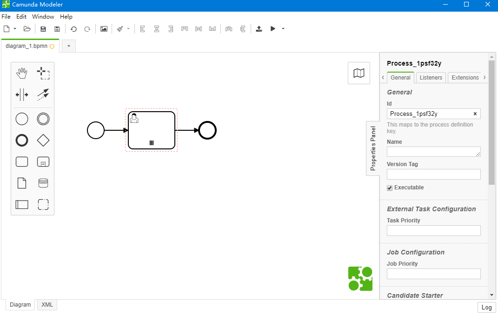
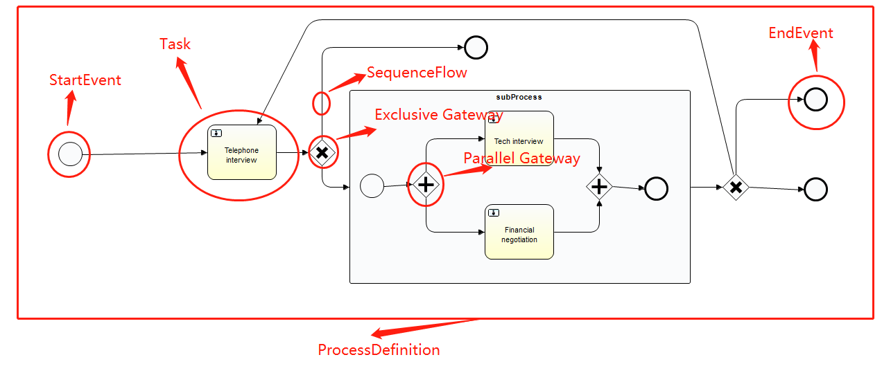

## Quick Start

[官方文档](https://docs.camunda.org/manual/7.15/introduction/)

通过容器启动一个Camunda服务：

```sh
docker run -d --name camunda -p 8080:8080 camunda/camunda-bpm-platform:run-latest
# 用户密码 demo/demo
```

创建模型：Camunda Modeler [[download](https://camunda.com/download/modeler/)] [[Github](https://github.com/camunda/camunda-modeler)]



在线编辑（https://bpmn.io/）

## 介绍

Camunda is a Java-based framework supporting **BPMN** for workflow and process automation, CMMN for Case Management and DMN for Business Decision Management.

Camunda是一个基于Java的框架，支持用于工作流和流程自动化的**BPMN**，用于案例管理的CMMN和用于业务决策管理的DMN。


WebApp:

+ Tasklist
+ Cockpit 驾驶舱
+ Admin 超管设置（用户、分组、租户、系统等）

### 架构

 

+ Api: 面向服务的API，允许Java应用程序与流程引擎交互。
+ BPMN Core Engine: 解析BPMN2.0xml文件为java对象和一组BPMN行为实现。
+ Job Executor:作业执行器负责处理异步后台工作，如进程中的计时器或异步延续。
+ Persistence:流程引擎具有一个持久层，负责将流程实例状态持久化到关系数据库。使用了MyBatis

## 说明

### 概念



+ process definition 流程定义；简单的认为就是画的流程图
+ process instance 流程图实例。
+ Task 任务，当流程流转到某个阶段，需要用户审核或者其他操作的时候，这个需要用户来完成的操作就是一个任务，除了用户任务之外，还有系统任务等其他任务
+ 执行人： 让某个用户执行，可以直接指定、指定候选人、指定候选组
+ Gateway： 网关，条件判断： 有 Inclusive、Exclusive和Parallel
+ 表单： 分内置和外联表单、业务表单
+ Execution 流程执行实例。 如果一个流程包含多个执行路径，就会有多个execution
+ Activity Instance 活动实例与执行的概念相近，但采用了不同的视角，虽然可以将执行像想为在流程中流动的令牌，但活动实例表示活动（任务、子流程）的单个实例。因此，活动实例的概念更面向状态
+ Process Variable 流程变量。是业务和流程引擎之间交互信息的载体。变量分为全局变量和本地变量
+ Tasklist 即任务列表，也就是待办任务。当流程节点是人工任务类型时，才可产生任务列表。
+ Job&Job Definition 作业执行器。作业执行器是一个调度组件，负责执行异步后台工作。
+ **Tenant** 租户
+ listener ： Task中可以定义一些监听器，用于完成一些复杂的逻辑业务。


### 核心接口

**ProcessEngine** 核心接口，提供了工作流所有的操作的api

1. RuntimeService 处理一个流程定义的运行实例(executing instance)，用于开启流程实例、删除流程实例、以及搜索流程实例等操作
2. TaskService 用于用户任务的认领、完成、分发等操作
3. IdentityService 用于提供身份认证以及管理用户和用户组
4. HistoryService 用于查询历史流程实例、历史任务以及历史流程变量等
5. FormService 用户内外联表单的渲染、通过提交表单开启流程实例、通过提交表单完成任务等
6. RepositoryService 提供用于管理和操作部署和流程定义的操作。
   + 查询引擎已知的部署和进程定义。
   + 挂起和激活进程定义。
   + 检索各种资源，例如引擎自动生成的部署或流程图中包含的文件。

7. HistoryService 历史数据搜集

8. ManagementService 返回数据表和结构

9. FilterService 管理filter

10. ExternalTaskService
11. CaseService for case instance (like RuntimeService )


### 任务表单

BPMN2.0中StartEvent和UserTask，支持连接任务表单。

表单是使用表单键(Form Keys)引用的，可以嵌入到Camunda任务列表(Tasklist)中，也可以由自定义应用程序处理。根据您的用例，可以使用不同的表单类型：

嵌入的任务表单(Embedded Task Forms):允许您将自定义HTML和JavaScript表单嵌入到任务列表中。

Camunda表单(Camunda Forms):在Camunda Modeler中提供表单的可视化编辑，可以用于不太复杂的表单。

外部任务表单(External Task Froms):可用于链接到自定义应用程序。表单不会嵌入到任务列表中。

如果没有表单键，则会显示一个通用任务表单。

#### 表单键

FORM-TYPE:LOCATION:FORM.NAME

| Name      | Description                                                  |
| :-------- | :----------------------------------------------------------- |
| FORM-TYPE | 可以是 `embedded` 或 `camunda-forms` .不设置的时候显示为外部任务表单. |
| LOCATION  | `deployment` 部署的一部分 。或者 `app`:在 `src/main/webapp/forms`，被打包进部署文件包. |
| FORM.NAME | 部署的路径和文件名, e.g. `forms/startFrom.html`              |

#### 嵌入的任务表单

HTML和JavaScript表单格式。

例如：创建一个Form_name.html

```html
<form role="form" name="form">
  <div class="form-group">
    <label for="customerId-field">Customer ID</label>
    <input required
           cam-variable-name="customerId"
           cam-variable-type="String"
           class="form-control" />
  </div>
  <div class="form-group">
    <label for="amount-field">Amount</label>
    <input cam-variable-name="amount"
           cam-variable-type="Double"
           class="form-control" />
  </div>
</form>
```

创建的这个表单键为：embedded:app:forms/FORM_NAME.html

可以在UserTask或StartEvent中使用它


#### Camunda表单

通过Camunda Modeler创建的，表单结构存储在.form文件。

可以使用如下形式的表单键

- `camunda-forms:deployment:FORM_NAME.form`
- `camunda-forms:app:forms/FORM_NAME.form`

使用Modeler创建时建议表单键设置为 camunda-forms:deployment。


要定义表单字段的默认值，需要定义与表单字段键同名的流程变量。局部变量（例如，通过定义用户任务的输入参数创建的）优先于过程变量。


+ 如果存在和表单变量同名的流程变量，那么表单提交后，流程变量的值会被覆盖
+ 当用户任务有一个与表单字段键同名的输入参数时，将使用这个局部变量。在这种情况下，需要定义一个输出参数来将局部变量映射到流程变量，以便在其他流程元素中使用。
+ 当不存在与表单变量同名的变量时，在表单提交后新的流程变量将被创建

#### 外部任务表单

引用一个外部的html表单

```xml
<userTask id="theTask" camunda:formKey="app:FORM_NAME.html"
          camunda:candidateUsers="John, Mary"
          name="my Task">
```


> 参考 
>
> https://www.qyh.me/articles/camunda-get-started
>
> https://blog.maxisvest.com/camunda%E5%BC%95%E6%93%8E%E5%88%9D%E6%8E%A2/


### 数据库

https://docs.camunda.org/manual/7.15/user-guide/process-engine/database/database-schema/

- `ACT_RE_*`: `RE` 代表 repository. 包含静态信息如进程定义和进程资源（图像、规则等）。
- `ACT_RU_*`: `RU` 代表 runtime. 这些运行时表包含流程实例、用户任务、变量、作业等的运行时数据。引擎仅在流程实例执行期间存储运行时数据，并在流程实例结束时删除记录。
- `ACT_ID_*`: `ID` 代表 identity. 这些表包含用户、组等识别信息。.
- `ACT_HI_*`: `HI` 代表 history. 这些表包含历史数据，如过去的流程实例、变量、任务等。
- `ACT_GE_*`: General data,一般数据，用于各种用例。


BPMN


### REST API

https://docs.camunda.org/manual/7.15/reference/rest/

## WEB集成

https://bpmn.io/


[徐蒙的分享](http://218.3.150.105:8000/xu-meng/share/2021/06/22/2703/)

使用bpmnjs


想要使用右侧的属性栏就得安装上一个名为bpmn-js-properties-panel的插件。为了二次开发的方便已经下载集成在web项目文件下。可查看目录文件。

参考：

云程BPM系统 https://www.yunbangong100.com:31110/app/group

Scalable Form Platform(表单设计器)：https://scalable-form-platform.github.io/#/

bpmn.js教程：https://juejin.cn/post/6844904017584193544

camunda接口：https://docs.camunda.org/manual/7.15/reference/rest/


## 集成SpringBatch

> Step By Step

1. 创建spring-boot项目，引入camunda

2. 编写application.yml

3. 编写保存模型 .bpmn

4. META-INF下添加processes.xml

   ```xml
   <process-application
           xmlns="http://www.camunda.org/schema/1.0/ProcessApplication"
           xmlns:xsi="http://www.w3.org/2001/XMLSchema-instance">
   
       <process-archive>
           <process-engine>default</process-engine>
           <properties>
               <property name="isDeleteUponUndeploy">false</property>
               <property name="isScanForProcessDefinitions">true</property>
           </properties>
       </process-archive>
   
   </process-application>
   ```

   

5. 拷贝bpmn文件到resources目录

6. 启动spring-boot，访问localhost:8080


## 部署FS-Camunda

SVN路径：

```
FS-Anxinyun\trunk\codes\service\camundaDemo
```

该项目是java SpringBatch Maven项目。配置文件在application.yml

```yml
server:
  port: 8080 #流程引擎端口
  tomcat:
    uri-encoding: UTF-8
  servlet:
    context-path: /fs-workflow #url地址
    register-default-servlet: true

spring:
  application:
    name: camunda-demo-service
  jersey:
    application-path: /engine-rest #REST接口地址
  datasource:
    driver-class-name: org.postgresql.Driver
    url: jdbc:postgresql://10.8.30.39:5432/camunda0525 #流程引擎数据库
    username: FashionAdmin
    password: 123456
    tomcat:
      max-idle: 10
      max-wait: 10000
      min-idle: 5
      initial-size: 5
      validation-query: SELECT 1
      test-on-borrow: false
      test-while-idle: true
      time-between-eviction-runs-millis: 18800

camunda.bpm:
  filter:
    create: All tasks#
  admin-user:
    id: admin #流程引擎的用户名
    password: fs-workflow #流程引擎的用户密码
    firstName: admin
  auto-deployment-enabled: false
  webapp:
    index-redirect-enabled: true
    application-path: /camunda-workflow

mybatis:
  type-aliases-package: com.fs.camunda.bpm.example.entity
  mapper-locations: classpath:mybatis/mapper/*.xml

logging:
  level:
    com:
      fs:
        camunda:
          bpm:
            example:
              mapper: debug
```


启动 ExampleApplication主类。


访问：http://localhost:8080/fs-workflow/camunda-workflow/app/tasklist/default/#/login

登录密码： admin /fs-workflow 