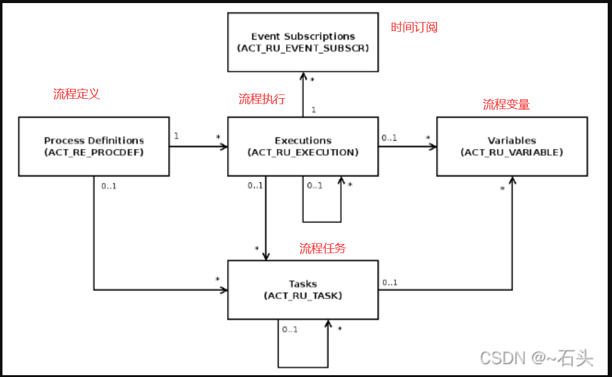

## 内部

转发 https://blog.csdn.net/qq_31868149/article/details/122652584 [~石头](https://blog.csdn.net/qq_31868149)

1. ACT_RE_*: 'RE’表示流程资源存储，这个前缀的表包含了流程定义和流程静态资源（图片，规则等），共5张表。
2. ACT_RU_*: 'RU’表示流程运行时。 这些运行时的表，包含流程实例，任务，变量，Job等运行中的数据。 Camunda只在流程实例执行过程中保存这些数据，在流程结束时就会删除这些记录， 这样运行时表的数据量最小，可以最快运行。共15张表。
3. ACT_ID_*: 'ID’表示组织用户信息，比如用户，组等，共6张表。
4. ACT_HI_*: 'HI’表示流程历史记录。 这些表包含历史数据，比如历史流程实例，变量，任务等，共18张表。
5. ACT_GE_*: ‘GE’表示流程通用数据， 用于不同场景下，共3张表。

+ REsource
+ RUtime
+ ID
+ HIstory
+ GEneral

| 分类         | 表名称                  | 描述                                    |
| ------------ | ----------------------- | --------------------------------------- |
| 流程资源存储 | act_re_case_def         | CMMN案例管理模型定义表                  |
| 流程资源存储 | act_re_decision_def     | DMN决策模型定义表                       |
| 流程资源存储 | act_re_decision_req_def |                                         |
| 流程资源存储 | act_re_deployment       | 流程部署表                              |
| 流程资源存储 | act_re_procdef          | BPMN流程模型定义表                      |
| 流程运行时   | act_ru_authorization    | 流程运行时收取表                        |
| 流程运行时   | act_ru_batch            | 流程执行批处理表                        |
| 流程运行时   | act_ru_case_execution   | CMMN案例运行执行表                      |
| 流程运行时   | act_ru_case_sentry_part |                                         |
| 流程运行时   | act_ru_event_subscr     | 流程事件订阅表                          |
| 流程运行时   | act_ru_execution        | BPMN流程运行时记录表                    |
| 流程运行时   | act_ru_ext_task         | 流程任务消息执行表                      |
| 流程运行时   | act_ru_filter           | 流程定义查询配置表                      |
| 流程运行时   | act_ru_identitylink     | 运行时流程人员表                        |
| 流程运行时   | act_ru_incident         | 运行时异常事件表                        |
| 流程运行时   | act_ru_job              | 流程运行时作业表                        |
| 流程运行时   | act_ru_jobdef           | 流程作业定义表                          |
| 流程运行时   | act_ru_meter_log        | 流程运行时度量日志表                    |
| 流程运行时   | act_ru_task             | 流程运行时任务表                        |
| 流程运行时   | act_ru_variable         | 流程运行时变量表                        |
| 组织用户信息 | act_id_group            |                                         |
| 组织用户信息 | act_id_info             | 用户扩展信息表                          |
| 组织用户信息 | act_id_membership       | 用户群组关系表                          |
| 组织用户信息 | act_id_tenant           | 租户信息表                              |
| 组织用户信息 | act_id_tenant_member    | 用户租户关系表                          |
| 组织用户信息 | act_id_user             | 用户信息表                              |
| 流程历史记录 | act_hi_actinst          | 历史的活动实例表                        |
| 流程历史记录 | act_hi_attachment       | 历史的流程附件表                        |
| 流程历史记录 | act_hi_batch            | 历史的批处理记录表                      |
| 流程历史记录 | act_hi_caseactinst      | 历史的CMMN活动实例表                    |
| 流程历史记录 | act_hi_caseinst         | 历史的CMMN实例表                        |
| 流程历史记录 | act_hi_comment          | 历史的流程审批意见表                    |
| 流程历史记录 | act_hi_dec_in           | 历史的DMN变量输入表                     |
| 流程历史记录 | act_hi_dec_out          | 历史的DMN变量输出表                     |
| 流程历史记录 | act_hi_decinst          | 历史的DMN实例表                         |
| 流程历史记录 | act_hi_detail           | 历史的流程运行时变量详情记录表          |
| 流程历史记录 | act_hi_ext_task_log     | 历史的流程任务消息执行表                |
| 流程历史记录 | act_hi_identitylink     | 历史的流程运行过程中用户关系            |
| 流程历史记录 | act_hi_incident         | 历史的流程异常事件记录表                |
| 流程历史记录 | act_hi_job_log          | 历史的流程作业记录表                    |
| 流程历史记录 | act_hi_op_log           |                                         |
| 流程历史记录 | act_hi_procinst         | 历史的流程实例                          |
| 流程历史记录 | act_hi_taskinst         | 历史的任务实例                          |
| 流程历史记录 | act_hi_varinst          | 历史的流程变量记录表                    |
| 流程通用数据 | act_ge_bytearray        | 流程引擎二进制数据表 (Bpmn文件存在这里) |
| 流程通用数据 | act_ge_property         | 流程引擎属性配置表                      |
| 流程通用数据 | act_ge_schema_log       | 数据库脚本执行日志表                    |

流程引擎的最核心表是流程定义、流程执行、流程任务、流程变量和事件订阅表。它们之间的关系见下面的UML模型。

## 部分表详情

### act_hi_detail（历史的流程运行详情表）

历史的流程运行变量详情记录表。流程中产生的变量详细，包括控制流程流转的变量，业务表单中填写的流程需要用到的变量等。

| 字段名称           | 字段类型      | 可否为空 | 描述             |
| ------------------ | ------------- | -------- | ---------------- |
| ID_                | varchar(64)   |          | 主键             |
| TYPE_              | varchar(255)  |          | 类型             |
| PROC_DEF_KEY_      | varchar(255)  | NULL     | 流程定义KEY      |
| PROC_DEF_ID_       | varchar(64)   | NULL     | 流程定义ID       |
| ROOT_PROC_INST_ID_ | varchar(64)   | NULL     | 流程实例根ID     |
| PROC_INST_ID_      | varchar(64)   | NULL     | 流程实例ID       |
| EXECUTION_ID_      | varchar(64)   | NULL     | 流程执行ID       |
| CASE_DEF_KEY_      | varchar(255)  | NULL     | 案例定义KEY      |
| CASE_DEF_ID_       | varchar(64)   | NULL     | 案例定义ID       |
| CASE_INST_ID_      | varchar(64)   | NULL     | 案例实例ID       |
| CASE_EXECUTION_ID_ | varchar(64)   | NULL     | 案例执行ID       |
| TASK_ID_           | varchar(64)   | NULL     | 任务ID           |
| ACT_INST_ID_       | varchar(64)   | NULL     | 节点实例ID       |
| VAR_INST_ID_       | varchar(64)   | NULL     | 流程变量记录ID   |
| NAME_              | varchar(255)  |          | 名称             |
| VAR_TYPE_          | varchar(255)  | NULL     | 变量类型         |
| REV_               | int(11)       | NULL     | 版本             |
| TIME_              | datetime      |          | 时间戳           |
| BYTEARRAY_ID_      | varchar(64)   | NULL     | 二进制数据对应ID |
| DOUBLE_            | double        | NULL     | double类型值     |
| LONG_              | bigint(20)    | NULL     | long类型值       |
| TEXT_              | varchar(4000) | NULL     | 文本类型值       |
| TEXT2_             | varchar(4000) | NULL     | 文本类型值2      |
| SEQUENCE_COUNTER_  | bigint(20)    | NULL     | 序列计数器       |
| TENANT_ID_         | varchar(64)   | NULL     | 租户ID           |
| OPERATION_ID_      | varchar(64)   | NULL     |                  |
| REMOVAL_TIME_      | datetime      | NULL     | 移除时间         |

### act_hi_identitylink（历史的流程运行过程中用户表）

历史的流程运行过程中用户表，主要存储历史节点参与者的信息。

| 字段名称           | 字段类型     | 可否为空 | 描述         |
| ------------------ | ------------ | -------- | ------------ |
| ID_                | varchar(64)  |          | 主键         |
| TIMESTAMP_         | timestamp    |          | 时间戳       |
| TYPE_              | varchar(255) | NULL     | 类型         |
| USER_ID_           | varchar(255) | NULL     | 用户ID       |
| GROUP_ID_          | varchar(255) | NULL     | 用户组ID     |
| TASK_ID_           | varchar(64)  | NULL     | 任务ID       |
| ROOT_PROC_INST_ID_ | varchar(64)  | NULL     | 流程实例根ID |
| PROC_DEF_ID_       | varchar(64)  | NULL     | 流程定义ID   |
| OPERATION_TYPE_    | varchar(64)  | NULL     | 操作类型     |
| ASSIGNER_ID_       | varchar(64)  | NULL     | 分配者ID     |
| PROC_DEF_KEY_      | varchar(255) | NULL     | 流程定义KEY  |
| TENANT_ID_         | varchar(64)  | NULL     | 租户ID       |
| REMOVAL_TIME_      | datetime     | NULL     | 移除时间     |

### act_hi_procinst（历史的流程实例表）

历史的流程实例表。

| 字段名称                   | 字段类型      | 可否为空 | 描述         |
| -------------------------- | ------------- | -------- | ------------ |
| ID_                        | varchar(64)   |          | 主键         |
| PROC_INST_ID_              | varchar(64)   |          | 流程实例ID   |
| BUSINESS_KEY_              | varchar(255)  | NULL     | 业务KEY      |
| PROC_DEF_KEY_              | varchar(255)  | NULL     | 流程定义KEY  |
| PROC_DEF_ID_               | varchar(64)   |          | 流程定义ID   |
| START_TIME_                | datetime      |          | 开始时间     |
| END_TIME_                  | datetime      | NULL     | 结束时间     |
| REMOVAL_TIME_              | datetime      | NULL     | 移除时间     |
| DURATION_                  | bigint(20)    | NULL     | 耗时         |
| START_USER_ID_             | varchar(255)  | NULL     | 启动人ID     |
| START_ACT_ID_              | varchar(255)  | NULL     | 启动节点ID   |
| END_ACT_ID_                | varchar(255)  | NULL     | 结束节点ID   |
| SUPER_PROCESS_INSTANCE_ID_ | varchar(64)   | NULL     | 父流程实例ID |
| ROOT_PROC_INST_ID_         | varchar(64)   | NULL     | 流程实例根ID |
| SUPER_CASE_INSTANCE_ID_    | varchar(64)   | NULL     | 父案例实例ID |
| CASE_INST_ID_              | varchar(64)   | NULL     | 案例实例ID   |
| DELETE_REASON_             | varchar(4000) | NULL     | 删除原因     |
| TENANT_ID_                 | varchar(64)   | NULL     | 租户ID       |
| STATE_                     | varchar(255)  | NULL     | 状态         |

### act_hi_taskinst（历史的任务实例表）

历史的任务实例表， 存放已经办理的任务。

| 字段名称           | 字段类型      | 可否为空 | 描述         |
| ------------------ | ------------- | -------- | ------------ |
| ID_                | varchar(64)   |          | 主键         |
| TASK_DEF_KEY_      | varchar(255)  | NULL     | 任务定义KEY  |
| PROC_DEF_KEY_      | varchar(255)  | NULL     | 流程定义KEY  |
| PROC_DEF_ID_       | varchar(64)   | NULL     | 流程定义ID   |
| ROOT_PROC_INST_ID_ | varchar(64)   | NULL     | 流程实例根ID |
| PROC_INST_ID_      | varchar(64)   | NULL     | 流程实例ID   |
| EXECUTION_ID_      | varchar(64)   | NULL     | 流程执行ID   |
| CASE_DEF_KEY_      | varchar(255)  | NULL     | 案例定义KEY  |
| CASE_DEF_ID_       | varchar(64)   | NULL     | 案例定义ID   |
| CASE_INST_ID_      | varchar(64)   | NULL     | 案例实例ID   |
| CASE_EXECUTION_ID_ | varchar(64)   | NULL     | 案例执行ID   |
| ACT_INST_ID_       | varchar(64)   | NULL     | 节点实例ID   |
| NAME_              | varchar(255)  | NULL     | 名称         |
| PARENT_TASK_ID_    | varchar(64)   | NULL     | 父任务ID     |
| DESCRIPTION_       | varchar(4000) | NULL     | 描述         |
| OWNER_             | varchar(255)  | NULL     | 委托人ID     |
| ASSIGNEE_          | varchar(255)  | NULL     | 办理人ID     |
| START_TIME_        | datetime      |          | 开始时间     |
| END_TIME_          | datetime      | NULL     | 结束时间     |
| DURATION_          | bigint(20)    | NULL     | 耗时         |
| DELETE_REASON_     | varchar(4000) | NULL     | 删除原因     |
| PRIORITY_          | int(11)       | NULL     | 优先级       |
| DUE_DATE_          | datetime      | NULL     | 超时时间     |
| FOLLOW_UP DATE     | datetime      | NULL     | 跟踪时间     |
| TENANT_ID_         | varchar(64)   | NULL     | 租户ID       |
| REMOVAL_TIME_      | datetime      | NULL     | 移除时间     |

### act_hi_varinst（历史的流程变量表）

历史的流程变量表。

| 字段名称           | 字段类型      | 可否为空 | 描述         |
| ------------------ | ------------- | -------- | ------------ |
| ID_                | varchar(64)   |          | 主键         |
| PROC_DEF_KEY_      | varchar(255)  | NULL     | 流程定义KEY  |
| PROC_DEF_ID_       | varchar(64)   | NULL     | 流程定义ID   |
| ROOT_PROC_INST_ID_ | varchar(64)   | NULL     | 流程实例根ID |
| PROC_INST_ID_      | varchar(64)   | NULL     | 流程实例ID   |
| EXECUTION_ID_      | varchar(64)   | NULL     | 流程执行ID   |
| ACT_INST_ID_       | varchar(64)   | NULL     | 节点实例ID   |
| CASE_DEF_KEY_      | varchar(255)  | NULL     | 案例定义KEY  |
| CASE_DEF_ID_       | varchar(64)   | NULL     | 案例定义ID   |
| CASE_INST_ID_      | varchar(64)   | NULL     | 案例实例ID   |
| CASE_EXECUTION_ID_ | varchar(64)   | NULL     | 案例执行ID   |
| TASK_ID_           | varchar(64)   | NULL     | 任务ID       |
| NAME_              | varchar(255)  |          | 名称         |
| VAR_TYPE_          | varchar(100)  | NULL     | 变量类型     |
| CREATE_TIME_       | datetime      | NULL     | 创建时间     |
| REV_               | int(11)       | NULL     | 版本         |
| BYTEARRAY_ID_      | varchar(64)   | NULL     | 二进制数据ID |
| DOUBLE_            | double        | NULL     | double类型值 |
| LONG_              | bigint(20)    | NULL     | long类型值   |
| TEXT_              | varchar(4000) | NULL     | 文本类型值   |
| TEXT2_             | varchar(4000) | NULL     | 文本类型值2  |
| TENANT_ID_         | varchar(64)   | NULL     | 租户ID       |
| STATE_             | varchar(20)   | NULL     | 状态         |
| REMOVAL_TIME_      | datetime      | NULL     | 移除时间     |

### act_re_deployment（流程部署表）

| 字段名称     | 字段类型     | 可否为空 | 描述     |
| ------------ | ------------ | -------- | -------- |
| ID_          | varchar(64)  |          | 主键     |
| NAME_        | varchar(255) | NULL     | 流程名称 |
| DEPLOY_TIME_ | datetime     | NULL     | 部署时间 |
| SOURCE_      | varchar(255) | NULL     | 来源     |
| TENANT_ID_   | varchar(64)  | NULL     | 租户ID   |

### act_re_procdef（流程定义表）

流程定义表，包含所有已部署的流程定义，诸如版本详细信息、资源名称或挂起状态等信息。

| 字段名称            | 字段类型      | 可否为空 | 描述                    |
| ------------------- | ------------- | -------- | ----------------------- |
| ID_                 | varchar(64)   |          | 主键                    |
| REV_                | int(11)       | NULL     | 版本                    |
| CATEGORY_           | varchar(255)  | NULL     | 流程定义的Namespace分类 |
| NAME_               | varchar(255)  | NULL     | 流程定义名称            |
| KEY_                | varchar(255)  |          | 流程定义KEY             |
| VERSION_            | int(11)       |          | 流程定义版本号          |
| DEPLOYMENT_ID_      | varchar(64)   | NULL     | 部署ID                  |
| RESOURCE_NAME_      | varchar(4000) | NULL     | 资源名称                |
| DGRM_RESOURCE_NAME_ | varchar(4000) | NULL     | DGRM资源名称            |
| HAS_START_FORM_KEY_ | tinyint(4)    | NULL     | 是否有启动表单          |
| SUSPENSION_STATE_   | int(11)       | NULL     | 流程挂起                |
| TENANT_ID_          | varchar(64)   | NULL     | 租户ID                  |
| VERSION_TAG_        | varchar(64)   | NULL     | 版本标签                |
| HISTORY_TTL_        | int(11)       | NULL     |                         |
| STARTABLE_          | tinyint(1)    |          | 是否是可启动流程        |